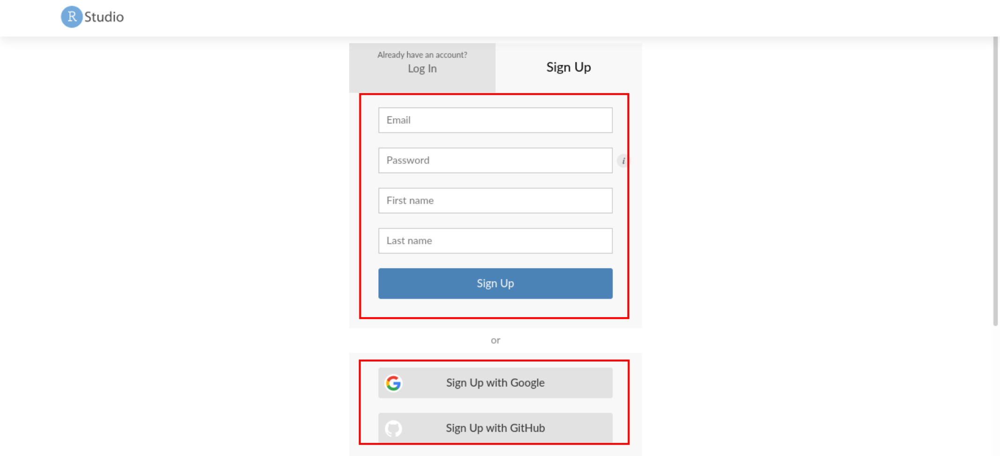

```{r setup, include=FALSE}
knitr::opts_chunk$set(echo = FALSE)
xaringanExtra::use_panelset()
```

# Mundo Ideal

Obviamente, se você quiser instalar o **R** (linguagem e ambiente de programação 
que usaremos) e o **RStudio** (interface gráfica que deixa nossa vida mais fácil
ao trabalhar com o R) em seu computador, será ótimo para estudos a longo prazo, 
bem como aprofundamento na linguagem!
Para isso, veja esse tutorial: [R-Guia de Instalação][GUIA]

[GUIA]: http://leg.ufpr.br/~fernandomayer/aulas/ce083-2016-2/R-instalacao.html

# Mundo Real

Porém, para nosso minicurso, você só precisa criar uma conta no [RStudio Cloud][RCLO].
Não será preciso instalar o **R**, nem o **RStudio** em seu computador!
Será tudo pela nuvem!

[RCLO]: https://rstudio.cloud/

Uma *internet*  estável também é desejável. 

### Passo a passo

Seguindo as passos a seguir, você estará apto para criar uma conta no [RStudio Cloud][RCLO].

::: {.panelset}
::: {.panel}
#### 1º Passo 
  - Acesse o *site* https://rstudio.cloud/
  - Clique em **Sign Up** (1.)
  
```{r}

```
:::

::: {.panel}
#### 2º Passo 
  - É suficiente escolher a opção **Free** (2.)
  - Depois aperte em **Sign Up** (3.)
  
```{r}

```
:::

::: {.panel}
#### 3º Passo 
  - Ou preencha seus dados e crie uma conta;
  - Ou use uma conta do Google (ou GitHub) para autenticação.
  
```{r}

```
:::
:::

### Conhecendo o RStudio

## O que mais usaremos?

Para quem usa Chrome, basta instalar a extensão, disponível no link:

- [Extensão Chrome](https://chrome.google.com/webstore/detail/selectorgadget/mhjhnkcfbdhnjickkkdbjoemdmbfginb?hl=pt-BR)

Para quem usa Mozilla ou algum outro browser não derivado do Chrome, pode usar
essa função:

```
:javascript:(function(){
  var%20s=document.createElement('div');
  s.innerHTML='Loading…'
  ;s.style.color='black';
  s.style.padding='20px';
  s.style.position='fixed';
  s.style.zIndex='9999';
  s.style.fontSize='3.0em';
  s.style.border='2px%20solid%20black';
  s.style.right='40px';
  s.style.top='40px';
  s.setAttribute('class','selector_gadget_loading');
  s.style.background='white';
    document.body.appendChild(s);
    s=document.createElement('script');
    s.setAttribute('type','text/javascript');
    s.setAttribute('src','https://dv0akt2986vzh.cloudfront.net/unstable/lib/selectorgadget.js');document.body.appendChild(s);
})();
```


Siga os seguintes passos para usar a função acima:

1. Copie o código acima;
2. Cole o código em seu navegador de internet (*browser*);
3. Salve como "Favorito" na barra de navegação do *browser*.

Pronto!
Veremos mais sobre essa ferramenta quando falarmos sobre `html`.


