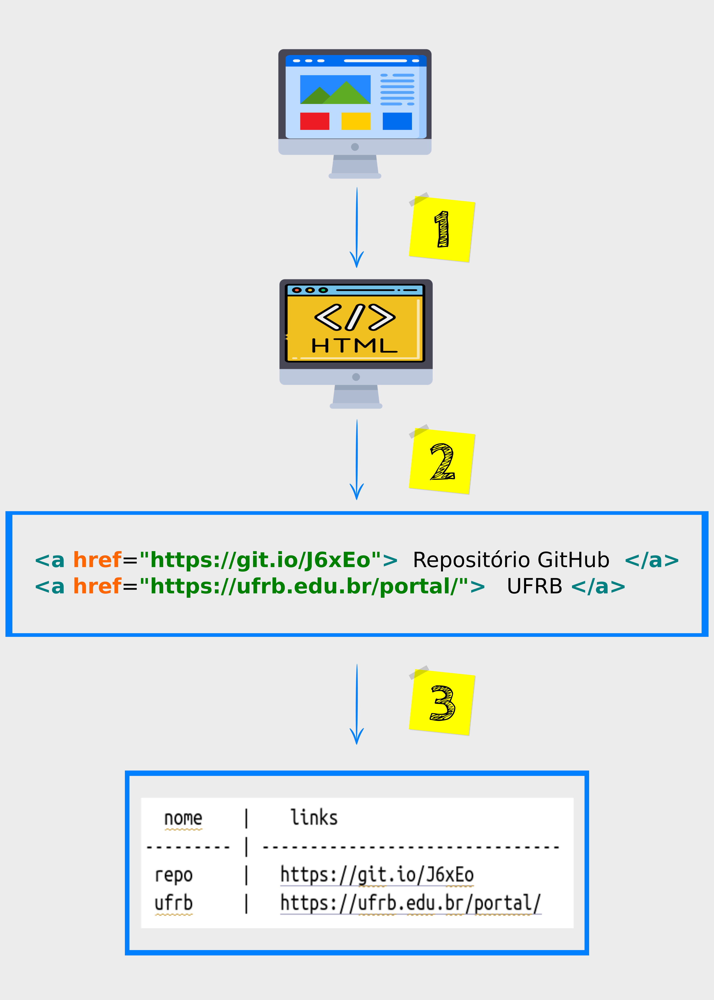

```{r setup, include=FALSE}
knitr::opts_chunk$set(echo = FALSE)
xaringanExtra::use_panelset()
```

# Antes de começar ... um aviso!

Obviamente, o processo de "raspagem de dados" na *internet* envolve muito mais 
do que tangenciaremos nesse Minicurso!

Nosso objetivo é que você tenha um primeiro contato com esse "mundo" e que seja
um contato prazeroso, claro! 

Entendemos que o **R**, especificamente com o pacote do *tidyverse* denominado
[`rvest`](https://rvest.tidyverse.org/) pode dar essa relação amigável entre 
a linguagem do **html**, própria da internet, e as etapas racionalmente encadeadas
para extrair o que desejamos delas.

Vamos, então, entender mais sobre o que é o processo de **Web Scraping**.

# 1. O que é o Web Scraping?

O termo *scraping* vem do verbo, em inglês, **scrape**, que significa "raspar".
Já o termo *web*, pode significar "rede", no caso, "rede de internet" [^1].
Então, poderíamos dizer que "Web Scraping" é um processo de "Raspagem da Rede".

Ficou estranho, né?
Talvez porque ... não é só isso!

Na internet, muita informação (**dados**) pode está espalhada de forma não 
muito estruturada para análise ou tomada de decisões.

> O processo de **leitura**, **seleção**, **limpeza** e **armazenagem** desses 
dados de forma automatizada é o que queremos dizer por "Web Scraping".

Por isso, vamos falar em "Raspagem de dados" como sinônmimo de "Web Scraping" ao 
longo desse texto.

## 1.1 Entendendo as etapas 

Obviamente, existem muitas formas de explicar o processo de web scraping. 
Todavia, ficaremos numa explicação intuitiva e mais direta, que resumimos em três etapas:

::: {.panelset}

::: {.panel}
### 1º etapa: Leitura

Primeiro, você deve saber que a página de um *site* é fruto de uma 
compilação/construção.
Existe uma [linguagem de marcação][MARK] que estabelece parâmetros para 
configurações do texto.

Em outras palavras (os antigos entenderão) existe uma [Matrix][NEW] por trás de
cada página de um site.
Ficaremos, apenas, na sua escrita.

Vamos testar: aperte o seguinte conjunto de teclas em seu computador:

> `CTRL + u` 

O que você viu (caso tenha apertado as teclas citadas acima) é, na realidade, 
como essa página foi escrita!
A linguagem de marcação utiliazada é o [html][HTML] (abreviação para 
*HyperText Markup Language*).

Então, para que você saiba "raspar" algum dado de um site da internet, deve-se 
"ler" o html associado à página do site.
Falaremos um pouco sobre as características do html daqui a pouco, mas, por 
enquanto, apenas considere que a leitura da página que você deseja, deve ser no
html associado à mesma.
Vamos denominar essa etapa de **leitura**.

> O pacote **rvest** usa a função ```read_html()``` para isso, não se preocupe!

:::
::: {.panel}
### 2º etapa: Arrumação

Tudo bem, você fez a "leitura" do site, mas nem tudo está como você deseja, não?
Existem apenas certos "elementos" que serão úteis para o que desejamos.
Talvez uma lista, ou um parágrafo, ou *links* , ou tabelas, etc.
Você deve selecionar esse agrupamento específico do html que foi realizado na 
"leitura".
Vamos chamar essa etapa de **seleção**

Todavia, atrelada à etapa de "seleção", existe uma subetapa: a de **limpeza**.
Isso porque, existem muitos símbolos e caracteres do html que não desejamos na 
saída do processo.

Em alguns casos, esse processo de "limpeza" é bem delicado e trabalhoso!
Poderíamos até separar em uma etapa específica do *Web Scraping*, mas para uma
introdução, vamos considerar como uma etapa só: **Arrumação**.

> O R disponibiliza muitas funções para a etapa de **Seleção e Limpeza**. 
> Pacotes como o **dplyr** e **stringr** serão muito úteis nesse processo!

:::
::: {.panel}
### 3º etapa: Armazenagem

Por fim, o processo de organizar os dados colhidos nas etapas anteriores, de 
maneira que possam ser acessados de forma direta, prática e "visual", vamos 
chamar de **Armazenagem**.

A saída pode ser um arquivo [.csv][CSV], ou uma lista de *download*, ou 
simplesmente uma saída organizada em um terminal.
Tudo dependerá de sua necessidade.

:::

:::

### 1.1.1 Visualização das etapas do Web Scraping

As etapas podem ser "visualizadas" na figura abaixo:

```{r, fig.align='center', out.width='90%'}

```

É natural sabermos, então, um mínimo da estruturação de um texto em `html`.
Mas, isso veremos no próximo texto!

[MARK]: https://pt.wikipedia.org/wiki/Linguagem_de_marca%C3%A7%C3%A3o
[HTML]: https://pt.wikipedia.org/wiki/HTML
[NEW]: https://pt.wikipedia.org/wiki/Matrix
[CSV]: https://pt.wikipedia.org/wiki/Comma-separated_values


<!---------------------------------------------------------------------------->
<!-- Notas de Rodapé
<!---------------------------------------------------------------------------->
[^1]: Na realidade, "Web (que vem do "www" -- *World Wide Web*) é um dos 
processos de acesso à internet.

