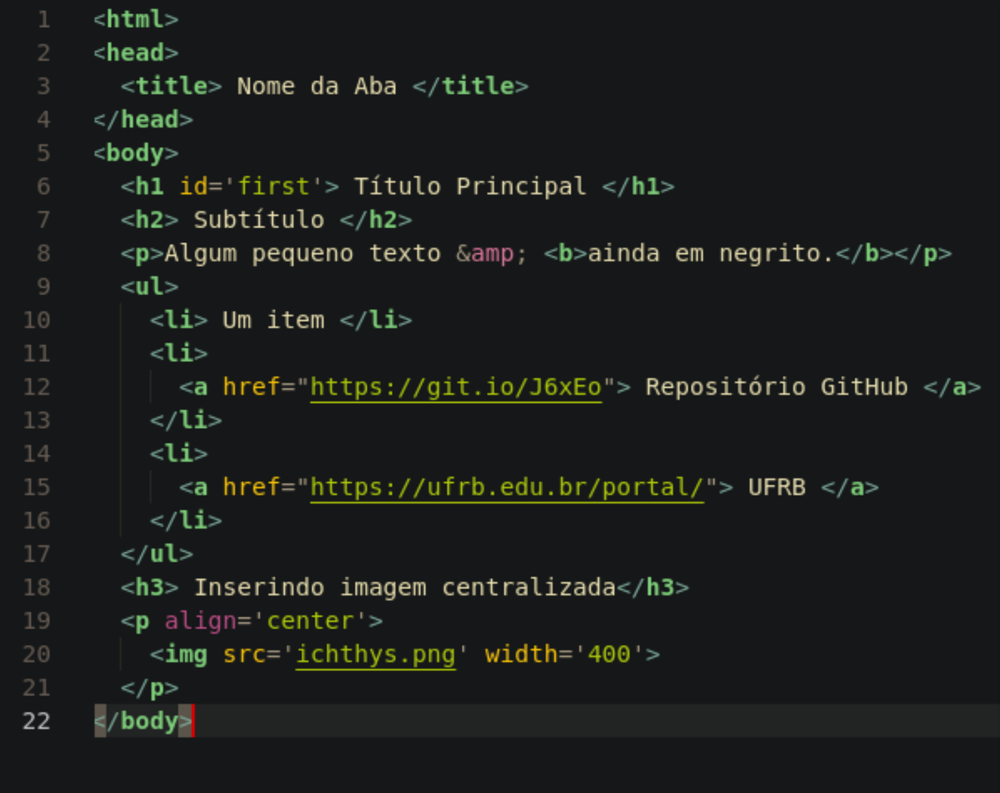
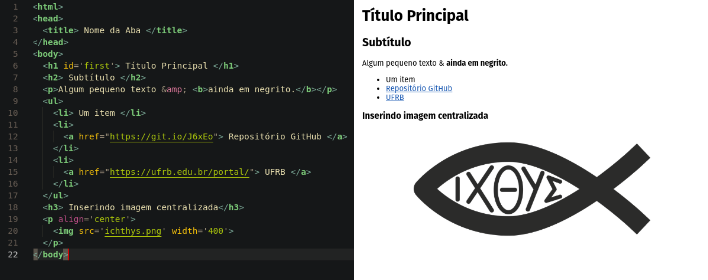
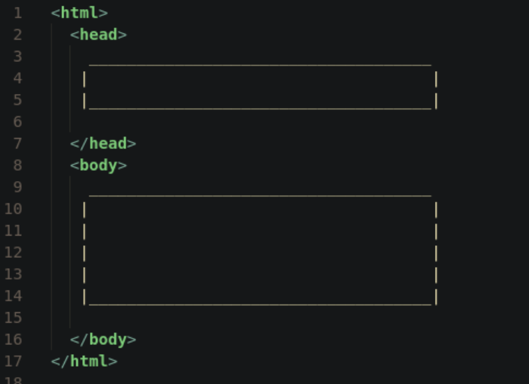
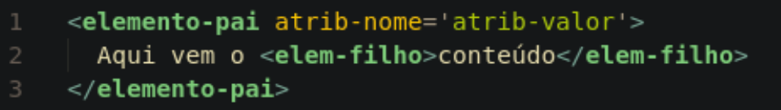
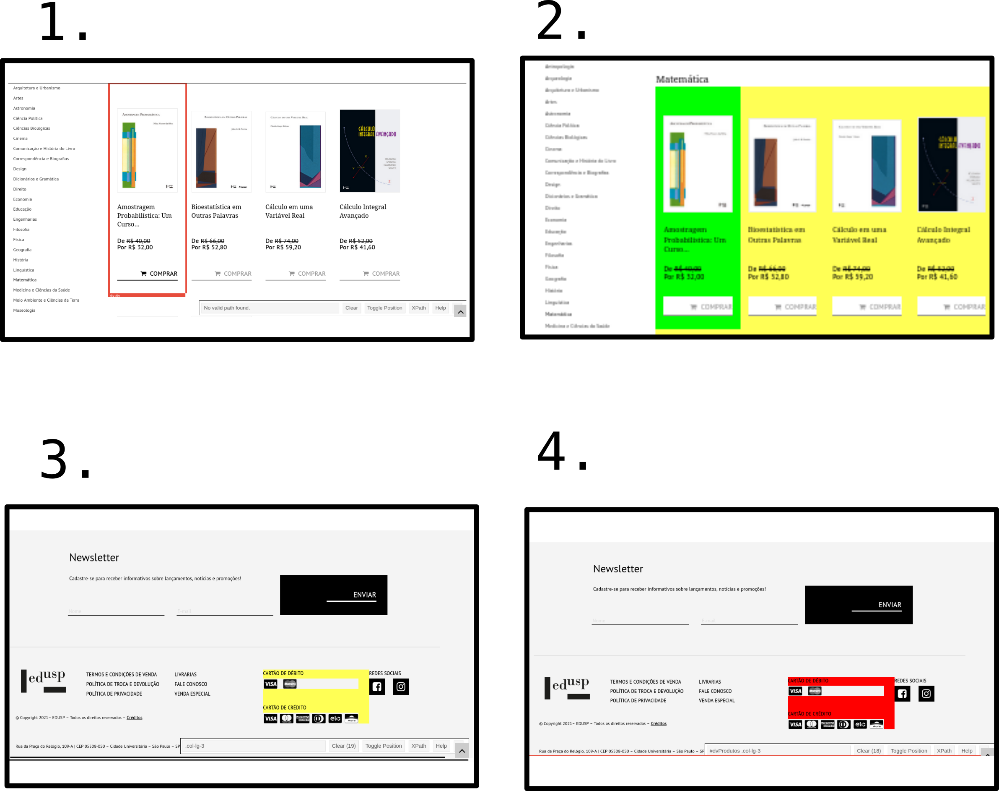

```{r setup, include=FALSE}
knitr::opts_chunk$set(echo = FALSE)
```

# 2. Estrutura do html

Observe o conjunto de códigos abaixo:

```{r, fig.align='center', out.width='90%'}

```

O *browser* (seu navegador de internet favorito) interpreta esses comandos e 
produz uma saída amigável, com a qual estamos acostumamos!

Veja como fica o código e sua saída, lado a lado:

```{r, fig.align='center'}

```

Algumas coisas saltam aos olhos nesse código:

  - Na linha 1 é exibida a classe que o texto foi escrito;
  - Da linha 2 até a linha 5 está uma parte do texto (delimitda pelo elemento `head`). 
    Essa parte não contém elementos que aparecem explicitamente na página gerada, 
    mas é de extrema importância para configurações;
  - Da linha 5 até a linha 22 está o corpo do texto (delimitado pelo elemento `body`).
    Encontra-se, nessa parte, o conteúdo principal do texto.
  
Ou seja, há uma certa estrutura no html que podemos resumir, graficamente, assim:
  
```{r, fig.align='center'}

```

Inicialmnte, percebemos que, para delimitar elementos do html, usamos *tags*.
  
> `<elemento> ... </elemento>`

Algumas *tags* não precisam de "abertura e fechamento", mas em sua maioria sim!
Vejam que, para o fechamento, usamos uma barra "/".

"Elementos" no html são compostos por *tags* que especificam um "elemento", 
seus "atributos" e o "conteúdo".
A estrutura visual é mais ou menos assim:

```{r, fig.align='center'}

```

Veja que, nos "elementos", estão: 

  - **elementos-pai**, delimitados por *tags*;
  - possíveis **atributos**, que possuem "nome" e "valor"; 
  - possíveis **elementos-filhos**;
  - e o seu próprio **conteúdo**.

Por exemplo, o código abaixo é um dos "elementos" que se encontram no código
inicial desse texto.

```
<a href='https://github.com/icaro-freire/site_webscraping'> 
  Repositório <b>GitHub</b> 
</a>
```

Nele, encontram-se:

  - o "elemento-pai" **a** e o "elemento-filho" (ou seja, que está contido no "a")
  **b**;
  - um "atributo"  do "elemento-pai", a saber **href='https://github.com/icaro-freire/site_webscraping'**
      + cujo **nome** é *href*
      + cujo **valor** é *https://github.com/icaro-freire/site_webscraping*, 
      geralmente delimitado por aspas (simples ou dupla).

Por curiosidade, uma das características do elemento "a" (*anchor*, que significa
"âncora") é colocar hiperlinks em algum objeto (texto, figuras, etc.).
Por isso, um atribulo de "a" é o "href" (**h**(ypertext) **re**f(erence), ou seja,
"referência para hipertexto").
O conteúdo do elemento "a" é o texto "Repositório **GitHub**", sendo que a palavra
"GitHub" está em negrito (*boldface*, em inglês).
Por isso, há um elemento-filho "b" que demarca o negrito.

Obviamente, não cobriremos nem a décima parte do total de "elementos" que compõem
o html.
Ficaremos com aqueles que serão usados nesse minicurso [^mozilla]

```{r}
df <- tibble::tibble(
  elemento = c("h1, ..., h6", "p", "'ol' ou 'ul'", "li", "img", "a", "b", "i", "table"),
  descricao = c(
    "Tamanhos crescentes dos títulos de seções",
    "Delimita parágrafos",
    "Cria 'listas ordenadas' (*ordered list*) ou 'listas não ordenadas' (*unordered list*)",
    "Demarca o início de um dos itens da lista",
    "Insere uma imagem no documento",
    "Para hiperlinks em páginas, imagens textos, etc.",
    "Para negrito", 
    "Para itálico", 
    "Para tabelas"
  )
)

knitr::kable(df)
```

Com essas informações, já estamos minimamente familiarizados com o html 
**para os objetivos desse curso**, claro.

[^mozilla]: Para mais, veja: https://developer.mozilla.org/pt-BR/docs/Web/HTML/Element

# 3. CSS?

Com tudo que aprendemos sobre html, podemos escrever um texto simples e direto,
salvando em `.html` que nosso *browser* irá interpretar como uma página web.

Caso queira fazer um teste, copie e cole o código abaixo num bloco de notas e 
salve em html por nome, por exemlo, `index.html`.
Além disso, escolha uma figura e deixe-a na mesma pasta onde se encontra o arquivo
html. 
Chame essa sua figura por `minha-figura.png` (aqui estou supondo que a extensão
da figura seja `png`).
Depois abra o arquivo `index.html` com seu navegador de internet padrão.

```{bash, eval=FALSE, echo=TRUE}
<html>
<head>
  <title> Nome da Aba </title>
</head>
<body>
  <h1 id='first'> Título Principal </h1>
  <h2> Subtítulo </h2>
  <p>Algum pequeno texto &amp; <b>ainda em negrito.</b></p>
  <ul>
    <li> Um item </li>
    <li> 
      <a href="https://git.io/J6xEo"> Repositório GitHub </a>
    </li>
    <li>
      <a href="https://ufrb.edu.br/portal/"> UFRB </a>
    </li>
  </ul>
  <h3> Inserindo imagem centralizada</h3>
  <p align='center'>
    
  </p>
</body>
```

Bom ... convenhamos ... fica feio, não?

Porém, para modificarmos a posição dos objetos numa página web, bem como cores,
espaçamentos, fontes, etc., precisamos do CSS (*Cascading Style Sheets*).
Todavia, não abordaríamos o CSS num minicurso tão introdutório como esse!

Para contornar isso, usaremos uma ferramenta que, justamente, retorna-nos o
cógigo CSS de um elemento que estamos inspecionando.
Isso torna a seleção inicial muito mais prática, embora não seja uma ferramenta
muito precisa!
Às vezes, será necessário selecionar algumas vezes o objeto até que fique do jeito
desejamos.
Usaremos o [SelectorGadget](https://selectorgadget.com/).

## 3.1 Como funciona o SelectorGadget?

Ao ativar a ferramenta, retângulos coloridos serão exibidos para que selecionemos
o objeto desejado.
Mas, geralmente, quando fazemos isso no primeiro "clique", outras partes **não** 
desejadas também são selecionadas.
Então, clicamos novamente sobre as partes que não desejamos!

> Veja: podem ocorrer duas etapas! 
> Na primeira, selecionamos o que desejamos.
> Se algum elemento não desejado estiver também selecionado, clicamos nele em seguida.

A cor "amarela" indica a seleção que desejamos e a cor "vermelha" indica a região
que eliminamos com o segundo clique.

### 3.1.1 Fazendo na prática

Considere o seguinte site:

> https://www.edusp.com.br/loja/assuntos/21/matematica

Nosso objetivo é selecionar a região onde se encontram os livros.

  1. Ativamos o SelectorGadget;
  2. Movimentamos o cursor do *mouse* até uma área que engloba o primeiro livro 
    (ficará um retângulo de borda "vermelha" englobando a imagem, o título, os 
    valores e o botão do carrinho de compras).
  3. Clicamos nessa região. 
    Em "verde" ficará a primeira região que clicamos e em amarelo TUDO o que 
    desejamos selecionar.
    Num retângulo inferior de exibição do SelectorGadget aparecerá o elemento 
    CSS: "**.col-lg-3**".
  4. Quer dizer ... nem tudo está correto! 
    Englobamos coisas a mais!
    Basta rolar o cursor do *mouse* até o final da página e veremos que uma 
    pequena região do "cartão de crédito" foi selecionada indevidamente!
    Então, basta clicarmos sobre ela até ficar "vermelha".
    Com isso, o elemento CSS foi refinado para "**#dvProdutos .col-lg-3**".
  
  Veja as imagens abaixo:
  
```{r, fig.align='center'}

```
  
