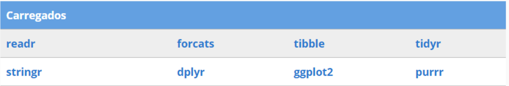
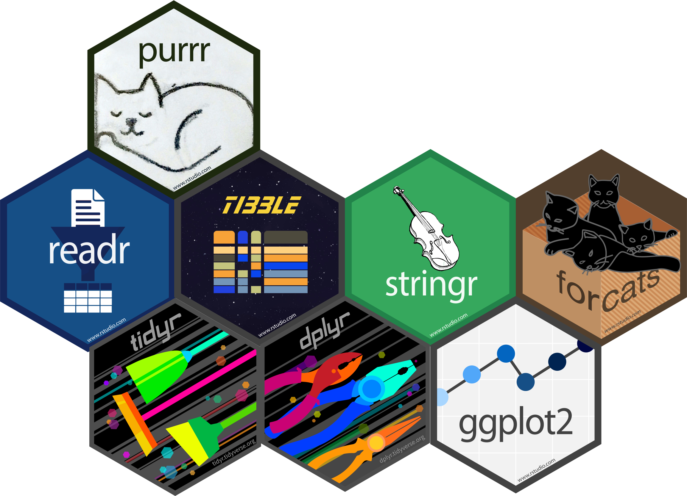

---
output:
  xaringan::moon_reader:
    css: xaringan-themer.css
    chakra: libs/remark-latest.min.js
    nature:
      slideNumberFormat: "%current%"
      highlightStyle: github
      highlightLines: true
      ratio: 16:9
      countIncrementalSlides: true
---
class: middle, center
background-image: url(img/capa2.png)
background-size: cover

---
class: middle, right
background-image: url(img/espera.gif)
background-position: left
background-size: contain

## Começamos em ...

.pull-right[
```{r, echo=FALSE}
countdown::countdown(
  minutes = 5, 
  seconds = 30, 
#  left = 0, right = 0,
  play_sound = TRUE,
  padding = "50px", 
#  margin = "20%",
  font_size = "4em"
)
```
]

```{r xaringan-themer, include=FALSE, warning=FALSE}
library(xaringanthemer)
style_duo_accent(
  primary_color = "#1F487E", #"#061A40",
  secondary_color = "#E98A15",
  inverse_header_color = "#FFFFFF"
)
```

```{r xaringanExtra, echo=FALSE}
xaringanExtra::use_tile_view()   # para overview
xaringanExtra::use_scribble()    # para fazer anotações
xaringanExtra::use_panelset()    # para abas
xaringanExtra::use_clipboard()   # botão para copiar código
xaringanExtra::use_extra_styles(
  hover_code_line = TRUE,         #<<
  mute_unhighlighted_code = TRUE  #<<
)
xaringanExtra::use_progress_bar(color = "#0051BA", location = "top")
```

---
class: middle, left
background-image: url(img/check-list.gif)
background-position: right
background-size: contain

## O que veremos hoje?

- Algo sobre o `R`
- Algo sobre o `tidyverse`


---
class: inverse center middle

# Algo sobre o R

---
class: middle, left
background-image: url(img/Rlogo.png)
background-position: right
background-size: 500px

## Considerações iniciais

--
- `R` é uma **linguagem** e **ambiente** de programação
  + IDE Nativa ou Terminal
  + implementação de pacotes ( _package_ )  

--
- Desenvolvido na década de 90;

--
- "Popular" no meio acadêmico;

--
- Possui código aberto e é gratuito!

--
- Roda em Linux, Windows e Mac;

--
- Fundamental em Estatística
  + muitas ferramentas gráficas
  + qualidade para publicação

--
- Uma comunidade muito ativa!

--
- Extensa documentação.

--
- Fundamental para reprodutibilidade


---
## Estruturação do R

--

- Classe de Objetos
  + `logical`; `numeric`; `integer`; `character`; `factor`; `date`
--

- Estrutura de Dados
  + `c()` (vetores, 1D)
  + `matrix` (matrizes, 2D)
  + `array` (arranjos, 3D)
  + `list` (listas)
  + `data.frame` (subconjunto de `list`: tabelas especiais)
--

- Gráficos
  + `plot`; `ggplot2`
--

- Programação
  + `for`; `while`; `if`
  + `function`
  + `read.table`, `write.table`; `read.csv`, `write.csv`
--

- Reprodutibilidade
  + RMarkdown

---

## Conhecendo algumas coisas ...

.panelset[

.panel[.panel-name[Rudimentos]

comando   | descrição
-------   | ---------
`?objeto`                   | obtem ajuda sobre o `objeto`
`str()`                     | sumário do conjunto de dados
`class()`                   | mostra a classe do objeto
`install.packages("nome")`  | instala um pacote (note as aspas!)
`library(nome)`             | carrega um pacote específico
`pacote::funcao()`          | carrega, apenas, uma função específica do pacote
`x <- a`                    | atribui à variável `x` o objeto `a`
`(x <- a)`  ou `x <- a; x`  | atribui e exibe a variável `x`
`x` ou `print(x)`           | exibe a variável `x`
`rm(list = ls())`           | remove todas as variáveis carregadas 

]

.panel[.panel-name[Math]

comando  | descrição
-------  | ----------
`a + b`; `a - b`; `a * b`; `a / b` | adição, subtração, multiplicação e divisão
`a^b` | potenciação
`sqrt(a)` | raiz quadrada
`exp(a)` | exponencial
`log(a)` | logarítmo NEPERIANO (ou seja, na base `e`)
`log10(a)` | log na base 10
`log(a, b)` | log de `a` na base `b`
`a%%b` | exibe o **resto** da divisão de `a` por `b`
`a%/%b` | exibe o **quociente** da divisão de `a` por `b`
`round(x, n)` | arredonda `x` com `n` casas decimais
]

.panel[.panel-name[Operadores Lóogicos]
Eles retornarão um dos valores lógicos: `TRUE`, se **verdadeiro**; `FALSE`, se **falso**.

comandos | descrição
-------- | ----------
`a == b` | `a` é **igual** a `b`
`a != b` | `a` é **diferente** de `b`
`a >= b` | `a` é **maior ou igual** do que `b`
`a <= b` | `a` é **menor ou igual** do que `b`
`a > b`  | `a` é **estritamente maior** do que `b`
`a < b`  | `a` é **estritamente menor** do que `b`
`a & b`  | ocorre `a` **e** `b` (simultaneamente)
`a` &VerticalLine; `b`  | ocorre `a` **ou** `b` (união)
]

.panel[.panel-name[Vetores]

comandos | descrição
-------- | ----------
`c(a, b, ...)` | cria os elementos `a, b, ...` de um vetor
`a:b` | cria uma sequência inteira de `a` até `b`
`seq(a, b)` | mesmo que anterior
`seq(a, b, by = c)` | espaça de `c` em `c` os elementos de `a` até `b`
`x[n]` | seleciona o `n`-ésimo elemento do vetor
`x[-n]` | seleciona todos, menos o `n`-ésimo
`x[a:b]` | seleciona de `a` até `b`
`x[-(a:b)]` | seleciona todos, exceto aqueles de `a` até `b`
`x[c(a, b)]` | seleciona os elementos na posição `a` e `b` 
`x[ x %in% c(a, b, ...) ]` | seleciona os elementos "contidos" em `c(a, b, ...)`
]

.panel[.panel-name[Listas]

.pull-left[
- Estrutura muito geral: seu elementos podem ser quaisquer dos objetos em `R`;
- Selecionamos seus elementos pela `posição` ou pelo `nome` 
  + para selecionar pelo nome, usamos o `$` 
  + Ex: `lista[3] == lista$coisa_doida`
]
.pull-right[
```{r}
lista <- list(
  data = c("2021/10/01", "2021/09/01", "2021/08/01"),
  despesa = c(2000, 800, 1000),
  coisa_doida = c("Pode até um conjunto de caracteres!")
)

lista
```
]
]

.panel[.panel-name[Data Frame]
- Tipo especial de Lista: todas as variáveis possuem as mesmas dimensões
- É o equivalente às "tabelas", que já conhecemos
- Veremos que as `tibbles` melhorarão a ideia dos `data.frame`
- Selecionamos as variáveis com "`$`" (por exemplo: `tabela_livros$livro`)

```{r}
tabela_livros <- data.frame(
  livro = c("Álgebra", "Geometria", "Análise"),
  preco_antigo = c("R$ 45.99", "R$ 30.50", "R$ 80.00"),
  preco_novo = c("R$ 32.1", "R$ 25.50", "R$ 72.00")
)

tabela_livros

```

]

.panel[.panel-name[Funções]
- Estrutura geral: `nome_funcao <- function(varivavel){condicao}`

.pull-left[

#### Exemplo

```{r, eval=FALSE}
# estimativa de "pi" ------------------
pi_estimativa <- function(n){
  x <- runif(n, -1, 1) 
  y <- runif(n, -1, 1)
  plot(x, y)
  raio <- sqrt(x^2 + y^2)
  pontos_dentro <- raio[raio < 1]
  print(4 * length(pontos_dentro) / n )
}  

# calculando para 1000 pontos ---------
pi_estimativa(2000)


```

]
.pull-right[

```{r, echo=FALSE, out.width='70%', fig.align='center'}
# estimativa de "pi" ------------------
pi_estimativa <- function(n){
  x <- runif(n, -1, 1) 
  y <- runif(n, -1, 1)
  plot(x, y)
  raio <- sqrt(x^2 + y^2)
  pontos_dentro <- raio[raio < 1]
  print(4 * length(pontos_dentro) / n )
}  

# calculando para 1000 pontos ---------
pi_estimativa(2000)

```
]
]

.panel[.panel-name[Classe]

### Pequenos Detalhes

classe      | observações
----------  | -----------
`logic`     | retorna `TRUE` ou `FALSE`
`numeric`   | tanto inteiro, como decimal ( _double_ )
`integer`   | somente inteiro (ajuda no processamento)
`character` | são caracteres ( _strings_ ) de texto (`1 != "1"`  )
`factor`    | são caracteres que possuem **níveis** ( _levels_ )
]


] 

<!---------------------------------------------------------- final do panel -->

---
## Como usar o R?

- Na IDE nativa;
- No terminal;
- No RStudio (localmente);
- No **RStudio Cloud** (remotamente)
- etc

```{r, echo=FALSE, fig.align='center', out.width='70%'}
knitr::include_graphics("https://www.rstudio.com/wp-content/uploads/2018/10/RStudio-Logo-Flat.png")
```

---
## Conhecendo o RStudio Cloud

```{r, echo=FALSE, fig.align='center', out.width='85%'}
knitr::include_graphics("img/panel.png")
```

---
class: inverse center middle

# Intervalo

---
class: middle, right
background-image: url(img/espera.gif)
background-position: left
background-size: contain

## Voltamos em ...

.pull-right[
```{r, echo=FALSE}
countdown::countdown(
  minutes = 15, 
  seconds = 00, 
#  left = 0, right = 0,
  play_sound = TRUE,
  padding = "50px", 
#  margin = "20%",
  font_size = "4em"
)
```
]

---
class: inverse center middle

# Algo sobre o Tidyverse

```{r, echo=FALSE, fig.align='center', out.width='30%'}
knitr::include_graphics("img/tidyverse.png")
```

---
# Estabilidade vs Flexibilidade

- `R` é uma **linguagem** e **ambiente** de programação estatística

--

- É um projeto amplo e muito bem estabelecido.

--

- Essa _estabilidade_ da linguagem `R` é um dos aspectos buscados por seus desenvolvedores.

--

- O `R` permite que usuários desenvolvam seus próprios pacotes: aí está sua _flexibilidade_.

--

.pull-left[
### Por que criar um pacote em R?

- Automatizar certos procedimentos usuais (repetitivos); 

- Simplificar um conjunto de procedimentos que as funções do `R Base` disponibilizam;

- Preferências individuais.
]

--

.pull-right[
### Qual é um pacote popular para análise de dados?

```{r, echo=FALSE, out.width="20%", fig.align="center"}
knitr::include_graphics("img/tidyverse.png")
```
]

---
name: tidyverse
background-image: url(img/tidyverse.png)
background-size: 90px
background-position: 1020px 60px

# O que é o Tidyverse?

--

> O tidyverse é um conjunto de pacotes que funcionam em harmonia porque compartilham representações de dados comuns e design de API. 
> O pacote tidyverse é projetado para facilitar a instalação e o carregamento de pacotes principais do próprio tidyverse em um único comando.

--

- Ou seja, o Tidyverse é um pacote que _instala_ e _carrega_ outros pacotes.

--

.pull-left[
- Ele instala cerca de 26 pacotes
]

--

.pull-right[
- Mas, só carrega 8 pacotes diretamente!
]

--

.pull-left[
```{r, echo=FALSE}

```
]

--

.pull-right[
```{r, echo=FALSE}

```

]

---
# Aqueles que são carregados ...

--

.pull-left[
```{r, echo=FALSE}

```
]

--

.pull-right[
- [**readr**][LER]: para importação de dados (`.csv`, dentre outras variações);
- [**stringr**][STR]: para _strings_, ou seja, manipulação de fragmentos de texto;
- [**forcats**][CATS]: para manipular variáveis categóricas (qualitativas);  
- [**tibble**][TIB]: uma melhora substancial nos antigos _data frames_;
- [**tidyr**][TIDY]: para organização dos dados (pivotagem de dados);
- [**dplyr**][DPLY]: para manipulação de dados (limpeza, transformação, etc.);
- [**ggplot2**][GRAF]: para visualização de dados (graficos em alto nível);
- [**purrr**][PURR]: para programação funcional.

[LER]:  https://readr.tidyverse.org/
[CATS]: https://forcats.tidyverse.org/
[PIPE]: https://magrittr.tidyverse.org/
[TIB]:  https://tibble.tidyverse.org/
[TIDY]: https://tidyr.tidyverse.org/
[STR]:  https://stringr.tidyverse.org/
[DPLY]: https://dplyr.tidyverse.org/
[GRAF]: https://ggplot2.tidyverse.org/
[PURR]: https://purrr.tidyverse.org/
]

---
## Ideia sobre as Tibbles

--

- O pacote `tibble` modifica a ideia dos `data frames` (do `R Base`)

--

- Evita coerções indesejadas de alguns elementos para vetor;

--

- Mostra, no console, de forma mais enxuta o conjunto de dados.

--

```{r, echo=FALSE, out.width="40%", fig.align='center'}

```


---
## Data Frame

```{r, echo=FALSE}
iris
```

---
## Tibble

```{r, echo=FALSE}
iris_tb <- tibble::as_tibble(iris) 
iris_tb
```


---
## Ideia sobre o Pipe `%>%` (ou `|>`)

--

```{r, echo=FALSE, out.width="50%", fig.align='center'}

```


--

- escrever o encadeamento do código como pensamos; 

--

- bem como escrevê-lo em etapas bem delimitadas, trazendo clareza em cada linha de código.

---
## Relembrando funções compostas

.pull-left[
- Lembram das funções compostas?
$$h(g(f(x)))$$
- Como pensamos?
  1. Pegue o $x$, **então**
  1. Avalie em $f$, **então**
  1. Avalie $f(x)$ em $g$, **então**
  1. Avalie $g(f(x))$ em $h()$
  
```{r, echo=FALSE, out.width="50%", fig.align='center'}

```

]

--

.pull-right[
- Usando o ` %>% ` ficaria assim:

```{r, eval=FALSE}
x %>% f() %>% g() %>% h()
```

- Na prátrica, escrevemos assim:

```{r, eval=FALSE}
x %>% 
  f() %>% 
  g() %>% 
  h()
```

- Onde:
  * $x$ é um conjunto de dados no formato `tibble`
  * $f, g$ e $h$ são algumas das funções dos pacotes do `tidyverse`.
]

---
## Um exemplo 

.pull-left[
- Por exemplo, se `mpg` é nosso conjunto de dados, suponha que eu queira fazer os seguintes procedimentos:

1. **filtrar** (_filter_) os carros que rodem acima de 15 milhas por galão e abaixo de 35 milhas por galão, na estrada (`hwy`);
1. **modificar** (_mutate_) a variável `hwy` criando uma coluna, por nome `km`, que transforma milhas em km (1 mi = 1.60 km, aproximadamente);
1. **selecionar** (_select_) essas milhas em km e a classe do carro (`class`)
1. **Plotar** (_ggplot_) um bloxplot com transparência de 50% (`alpha = 0.5`), comparando essas classes de carros com as kilometragens espalhadas pelo gráfico (`geom_jilter`).
]

--

.pull-right[
- O código `R` ficaria assim:

```{r, eval=FALSE}
mpg |> 
  filter(hwy > 15  & hwy < 30) |> 
  mutate(km = hwy * 1.60) |> 
  select(class, km) |> 
  ggplot(aes(class, km, fill = class)) +
  geom_boxplot(alpha = 0.5) +
  geom_jitter(aes(color = class))  
```


- Veja que podemos usar o pipe nativo (`|>`) ou o do pacote `magrittr` (`%>%`).
- Usaremos o `%>%` quando precisarmos passar algum argumento que não esteja na 
primeira posição.
]
---
- Apenas por curiosidade, o código anterior produz o que se segue.

</br>

```{r, message=FALSE, echo=FALSE, fig.align='center', fig.width=9, fig.height=3.5, out.width = "100%", fig.retina=3}

library(dplyr)
library(ggplot2)

mpg |> 
  filter(hwy > 15  & hwy < 30) |> 
  mutate(km = hwy * 1.60) |> 
  select(class, km) |> 
  ggplot(aes(class, km, fill = class)) +
  geom_boxplot(alpha = 0.5) +
  geom_jitter(aes(color = class))  
```

---
## Por que usar o Tidyverse?

### Alguns argumentos

--

.pull-left[

- Filosofia de análise

- Práticas que "tentam facilitar uma conversa entre um ser humano e um computador sobre dados"

- Facilitam a usabilidade (principalmente para quem está começando)

- Agregam no processamento dos dados.
    + escrever para que humanos "comuns" (fora da área de programação) usem
    + fazer que o computador processe adequadamente os dados.
]

--

.pull-right[

- Pilares da filosofia `tidy`:
  
  1. Reutilização de estruturas de dados já existentes;
  2. Composição entre funções de forma simples, com o ` %>% `;
  3. Utilização da [Programação Funcional](https://pt.wikipedia.org/wiki/Programa%C3%A7%C3%A3o_funcional#:~:text=Em%20ci%C3%AAncia%20da%20computa%C3%A7%C3%A3o%2C%20programa%C3%A7%C3%A3o,mudan%C3%A7as%20no%20estado%20do%20programa.);
  4. Feito para humanos
  
- Ao aprender a estrutura de um único pacote do `tidyverse`, isso facilitará o aprendizado de outros pacotes da mesma família;
- Ajuda de uma grande comunidade de usuários do pacote
]

---
class: inverse center middle

# O que vamos usar nesse minicurso?

---
## rvest

.pull-left[
```{r, echo=FALSE, fig.align='center', out.width='20%'}
knitr::include_graphics("img/logo_rvest.png")
```

- Possui as ferramentas essenciais ao Web Scraping
- Usamos funções adequadas para extrair e selecionar os dados no HTML

#### Observações!
- Algumas vezes ocorrem erros de certificado, em sites
- Para esses casos, **antes** do `read_html()`, usamos o seguinte código:

```{r, eval=FALSE}
httr::GET(httr::config(ssl_verifypeer = FALSE)) 
```

]

.pull-right[

### Funções que usaremos

função | descrição
------ | ---------
`read_html()` | faz a leitura do html 
`html_elements()` | seleciona os elementos CSS 
`html_attr()` | seleciona os atributos
`html_text2()`  | seleciona o texto do conteúdo
`html_table()`  | seleciona umatabela

]

---
## Vamos praticar ...

.pull-left[

#### No link [https://git.io/JMTRO](https://git.io/JMTRO), faça:

- Raspar a tabela
- Raspar os links
- Raspas os nomes associados aos links

]

.pull-right[

```{r, echo=FALSE, fig.align='center', out.width='80%'}
knitr::include_graphics("img/site_print.png")
```

]

---
## Outros pacotes que usaremos

função | descrição
------ | ----------
`readr::parse_double()` | converte caracteres em classe numérica
`readr::write_csv(variavel, "caminho/nome.csv")` | forma um csv
`dplyr::if_else(cond., caso-verdade, caso-contrário)` | estabelece condicional numa tibble
`stringr::subset()` | seleciona um padrão, dentre os fraguementos
`stringr::str_sub(string, start = ..., end = ...)` | de onde começar a extrair em cada linha
`stringr::str_replace_all(string, "padrão", "subs.")` | substitui tudo em algum padrão
`stringr::str_to_lower()` | torna tudo em minúsculas
`stringr::str_trim()` | retira os espaços em brancos
`stringi::stri_trans_general(nome_doido, "Latin-ASCII")` | retira toda acentuação
`lubridate::dmy(possiveis_datas)` | converte em data (dd/mm/aa)
`purrr::map_df(x, funcao)` | para iteração com tibbles
<!---------------------------------------------------------------------------->
---
class: center, middle

# Obrigado!

</br>
Slides criados com </br> [`xaringan`](https://github.com/yihui/xaringan) e [`xaringanthemer`](https://github.com/gadenbuie/xaringanthemer).

</br>
</br>
</br>

