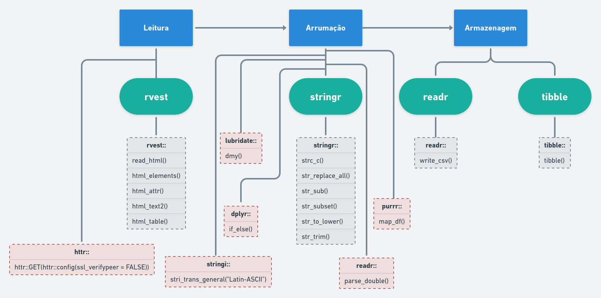
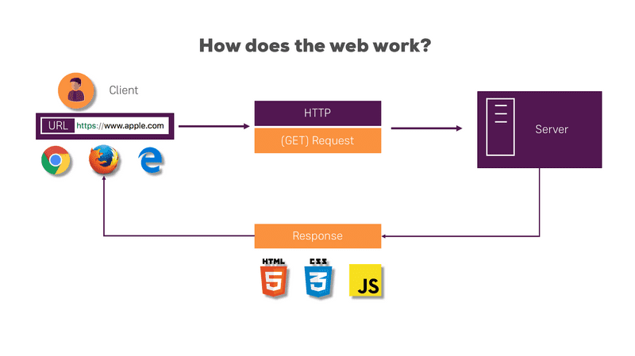

---
output:
  xaringan::moon_reader:
    css: xaringan-themer.css
    chakra: libs/remark-latest.min.js
    nature:
      slideNumberFormat: "%current%"
      highlightStyle: github
      highlightLines: true
      ratio: 16:9
      countIncrementalSlides: true
---
class: middle, center
background-image: url(img/capa3.png)
background-size: cover

---
class: middle, right
background-image: url(img/espera.gif)
background-position: left
background-size: contain

## Começamos em ...

.pull-right[
```{r, echo=FALSE}
countdown::countdown(
  minutes = 5, 
  seconds = 30, 
#  left = 0, right = 0,
  play_sound = TRUE,
  padding = "50px", 
#  margin = "20%",
  font_size = "4em"
)
```
]

```{r xaringan-themer, include=FALSE, warning=FALSE}
library(xaringanthemer)
style_duo_accent(
  primary_color = "#1F487E", #"#061A40",
  secondary_color = "#E98A15",
  inverse_header_color = "#FFFFFF"
)
```

```{r xaringanExtra, echo=FALSE}
xaringanExtra::use_tile_view()   # para overview
xaringanExtra::use_scribble()    # para fazer anotações
xaringanExtra::use_panelset()    # para abas
xaringanExtra::use_clipboard()   # botão para copiar código
xaringanExtra::use_extra_styles(
  hover_code_line = TRUE,         #<<
  mute_unhighlighted_code = TRUE  #<<
)
xaringanExtra::use_progress_bar(color = "#0051BA", location = "top")
```

---
class: middle, left
background-image: url(img/check-list.gif)
background-position: right
background-size: contain

## O que veremos hoje?

- Pacotes e funções para Web Scraping;
- Ética no Web Scraping
- Praticando o que aprendemos ...

---
## Panorama do Tabalho

```{r, echo=FALSE, fig.align='center'}

```

---
class: inverse center middle

# Leitura

---
## Relembrando o rvest

.panelset[

.panel[.panel-name[`read_html()`]

- Faz a leitura do site!
- Estrutura: `rvest::read_html("url-do-site")`

```{r}
rvest::read_html("https://git.io/JMTRO")
```
.pull-left[
- Forma indireta:

```{r}
# prepara url -------------------------
url_teste <- "https://git.io/JMTRO"

# salva a leitura do site -------------
site_teste <- rvest::read_html(url_teste)
```

]

.pull-right[
- Se ocorrer erro de certificação

```{r, eval=FALSE}
site_teste <- url |> 
  httr::GET(httr::config(ssl_verifypeer = FALSE)) |> 
  rvest::read_html()
```


]

]
.panel[.panel-name[`html_elements()`]

.pull-left[
- Seleciona os elementos HTML ou CSS associados.
- Use o SelectorGadget para auxiliar na escolha do CSS em questão
- A escolha adequada do elemento CSS pode reduzir o tempo de processamento e 
aliviar a memória de sua máquina!
- Sempre verifique se a extração ocorreu como desejada!


```{r}
site_teste |> 
  rvest::html_elements("a")
```
]

.pull-right[
nome          | descrição
-----------   | ----------
`h1` ... `h6` | seções
`p`           | parágrafo
`a`           | hyperlinks
`table`       | tabela
`ol`; `ul`    | listas
`li`          | item de lista
`b`           | negrito
`i`           | itálico

]

]
.panel[.panel-name[`html_attr()`]

- Seleciona o atributo associado a alguma _tag_
- Em nosso caso, um atributo associado à _tag_ `a` é a **referência do hyperlink**,
chamada `href`
  + ela possui um "nome" e um "valor"
  + desejamos extrair o "valor", geralmente

```{r, eval=FALSE}
site_teste |> 
  rvest::html_elements("a") |> 
  rvest::html_attr("href")
```

```{r, eval=FALSE}
https://www.mathunion.org/
https://sbm.org.br/
https://www.sbmac.org.br/
```

]
.panel[.panel-name[`html_text2()`]
- Seleciona o texto associado à _tag_, eliminando os espaços em branco, sempre que
possível.

```{r, eval=FALSE}
site_teste |> 
  rvest::html_elements("a") |> 
  rvest::html_text2()
```

```{r, eval=FALSE}
[1] "União Internaciional de Matemática (IMU)"                           
[2] "Sociedade Brasileira de Matemática (SBM)"                           
[3] "Sociedade Brasileira de Matemática Aplicada e Computacional (SBMAC)"
```


]
.panel[.panel-name[`html_table()`]
- Extrai uma tabela específica, se indicado o CSS;
- Extrai TODAS as tabelas, armazenando-as numa lista; se não indicado o CSS
- Se houver cabeçalho, usamos o argumento: `header = TRUE`

```{r}
site_teste |> 
  rvest::html_table(header = TRUE)
```

]
]

---
class: inverse center middle

# Arrumação

---
## Conhecendo o stringr

.panelset[

.panel[.panel-name[`str_sub()`]

.pull-left[
- Delimita a posição da extração nos caracteres
- Estruturação: `str_sub(start = a, end = b)`
- Uma desvantagem explícita é que precisamos contar as posições na string
  + dependendo do comprimento da string, isso pode ser um problema.

### Exemplo

```{r}
precos_teste <- c(
  "R$ 45,99", "R$ 32,10",
  "R$ 25,50", "R$ 80,00"
)
```
]
.pull-right[

```{r}
stringr::str_sub(precos_teste, 4)
stringr::str_sub(precos_teste, -5)
stringr::str_sub(precos_teste, 4, 5)
stringr::str_sub(precos_teste, end = -4)
```


]

]

.panel[.panel-name[`str_subset()`]

- Seleciona um subconjunto de caracteres, de acordo com algum padrão.
- Estrutura: `str_subset(variavel, "padrao")`
- Ter cuidado com "elementos especiais"
- Importante aprofundamento com REGEX.

```{r}
links_exemplos <- c(
  "https://www.obm.org.br/content/uploads/2017/01/eureka34.doc",
  "https://www.obm.org.br/content/uploads/2017/01/eureka34.pdf",
  "https://www.obm.org.br/content/uploads/2017/01/Eureka33.doc",
  "https://www.obm.org.br/content/uploads/2017/01/Eureka33.pdf",
  "https://www.obm.org.br/content/uploads/2017/01/eureka32.doc"
)

stringr::str_subset(links_exemplos, ".pdf")
```
]

.panel[.panel-name[`str_to_lower`]

- Coloca todas as letras em **minúsculas**
- Isso pode ser interessante na organização dos nomes dos arquivos.

### Exemplo

```{r}
frase_teste <-  c("LIVRO - Introdução ao Cálculo")

stringr::str_to_lower(frase_teste)

```

]

.panel[.panel-name[`str_replace_all`]
- Substitui um padrão anterior, por um novo.
- Estrutura: `str_replace_all("antigo", "novo")`

#### Exemplos

.pull-left[

```{r}
# substituindo pontuação --------------
precos_teste

precos_teste |> 
  stringr::str_sub(4) |> 
  stringr::str_replace_all(",", ".")
```

]

.pull-right[

```{r}
# organizando nomes de arquivos -------
frase_teste

frase_teste |> 
  stringr::str_to_lower() |> 
  stringr::str_replace_all(" - ", "_") |> 
  stringr::str_replace_all(" ", "-")
```
]
]

.panel[.panel-name[`str_trim()`]
- Elimina espaços em branco ou quebra de linhas
- Caracteres em HTML para essas situações: "`\n`", ou "`\r`"

```{r}
livros_exemplo <- c(
  "Cálculo em uma Variável Complexa \n", 
  "introdução à álgrebra \r", 
  "Álgebra Linear \r"
)

livros_exemplo

stringr::str_trim(livros_exemplo)
```
]

.panel[.panel-name[`str_c()`]

- Concatena uma sequência de caracteres; com possibilidade de escolher posição.

.pull-left[
```{r}
nome_pessoa <- "Astrobaldo"
sobrenome_pessoa <- "Beltrano"

stringr::str_c(nome_pessoa, sobrenome_pessoa)
stringr::str_c(nome_pessoa, " ", sobrenome_pessoa)
stringr::str_c(nome_pessoa, " - Belo nome!")
```
]
.pull-right[
```{r}
seq(1, 9)

index <- stringr::str_c("0", seq(1, 9))
index

stringr::str_c(index, "_eureka.pdf")
```
]
]

]

---
## Pacotes com funções importantes na Arrumação

.panelset[

.panel[.panel-name[`stringi`]

- Vamos usar a função `stri_trans_general("Latin-ASCII")` para retirar toda 
acentuação do fragmento de texto.

```{r}
frase_acento <- "Não há acentuação"

stringi::stri_trans_general(frase_acento, "Latin-ASCII")

```


]
.panel[.panel-name[`readr`]

- A função `parse_double()` transforma os números da classe `character` para `numeric`.
  + Atenção! Não é possível realizar cálculos com caracteres

.pull-left[

```{r}
precos_teste

preco_caractere <- precos_teste |> 
  stringr::str_sub(4) |> 
  stringr::str_replace_all(",", ".")

preco_caractere; class(preco_caractere)
```
]

.pull-right[

```{r}
preco_numerico <- preco_caractere |> 
  readr::parse_double()

preco_numerico

class(preco_numerico)
```

]

]
.panel[.panel-name[`lubridate`]

- Para transformação e cálculos com datas

.pull-left[

```{r}
data_caractere <- c("11/03/2022")

class(data_caractere)

data_data <- lubridate::dmy(data_caractere)

data_data

class(data_data)
```
]
 
 .pull-right[
 
 #### Outra possibilidade
 
```{r}
# usando readr

readr::parse_date(data_caractere, "%d/%m/%Y")
```

]

]
.panel[.panel-name[`dplyr`]
- Pata manipulação de tibbles.
- Usaremos para condicional em tibbles
- `if_else(condicao-desejada, "saida_caso-verdade", "saida_caso-contrário")`

```{r}
tabela_teste <- tibble::tibble(
  numero = c(1, 2, 3, 4),
  calculo = c(1, 4, 6, 9),
  teste = dplyr::if_else(calculo == 2 * numero, "certo", "errado")
)

tabela_teste
```

]

.panel[.panel-name[`dplyr::filter`]
- Como o próprio nome sugere, essa função do pacote `dplyr`, filtra o resultado 
desejado, de acordo com alguma condição lógica.
  + Sempre deve ser aplicada em `tibbles`.

```{r}
lista_desejada <- c(2, 7)

tabela_comparada <- tibble::tibble(
  nomes = LETTERS[1:10],
  valores = seq(1, 10),
)

tabela_comparada |> 
  dplyr::filter(valores %in% lista_desejada)


```


]

.panel[.panel-name[`purrr`]

.pull-left[

- Usada para iteração nos processos
- Estrutura: `purrr::funcao_purrr(args, funcao)`
- Usaremos a função `map_df()`
  + retorna uma tibble

```{r}
tabela_dobro <- function(x){
  tibble::tibble(
    numero = x,
    dobro  = 2 * x
  )
}

tabela_dobro(3)

```
]

.pull-right[

#### Iterando com purrr

```{r}
purrr::map_df(1:7, tabela_dobro)
```

]

]

]

---
class: inverse center middle

# Armazenagem

.pull-left[
- Podemos armazenar na memória RAM do computador ou em algum arquivo de extesão
conveniente.
  + se for armazenar em computador, usamos `tibbles`
  + se for em arquivos separados, uma extensão comumente usada é `.csv`; e, para
  esses casos, usamos a função `write_csv()` do pacote `readr`.
- Estruturação da função: `write_csv(variavel-formada, "caminho/nome-com-extensao.csv")`
]
.pull-right[

```{r, eval=FALSE}
tabelao <- purrr::map_df(1:1000, tabela_dobro)

write(tabelao, "documentos/tabelao.csv")
```

- O arquivo `tabelao.csv` foi salvo na pasta `documentos`; ambos dentro de seu
diretório de trabalho (pasta onde você está salvando os arquivos)

]

---
class: inverse center middle

# Ética no Web Scraping

---
## Sejamos Éticos!

.panelset[

.panel[.panel-name[`fluxo`]

```{r, fig.align='center', fig.cap="https://www.bastter.com", echo=FALSE, out.width='80%'}

```
]

.panel[.panel-name[`robots.txt`]

.pull-left[
- Uma forma de saber se o site permite a Raspagem de dados é acessar os **robots.txt**
  + [https://www.obm.org.br/robots.txt](https://www.obm.org.br/robots.txt)
- Sempre devemos ler o site para obtermos as informações devidas!

### Raspando páginas com educação: polite

- O pacote `polite` possui duas funções que são essenciais para raspagem de dados em várias páginas:
  + `bow()`; que acessa os robots.txt do site e cumpre as requisições nele contidas;
  + `scrape()`; que faz a leitura do HTML, ou seja, substitui o `rvest::read_html()`
  
]
.pull-right[

```{r, fig.align='center', echo=FALSE, out.width='70%'}
knitr::include_graphics("img/etica.jpg")
```

]
]

]

---
class: inverse center middle

# Parte Prática!

---
class: middle, right
background-image: url(img/fall2.gif)
background-position: left
background-size: contain

--
## Vai dar ...

--
## tudo certo!


---
## Situações que faremos ...

--

- Raspar tabela
  + [https://pt.wikipedia.org/wiki/R_(linguagem_de_programa%C3%A7%C3%A3o)](https://pt.wikipedia.org/wiki/R_(linguagem_de_programa%C3%A7%C3%A3o))
--

- Fazer o _download_ simultâneo de vários pdfs
  + [https://www.obm.org.br/revista-eureka/](https://www.obm.org.br/revista-eureka/)
--

- Tabela de decisão
  + [https://www.edusp.com.br/loja/assuntos/21/matematica](https://www.edusp.com.br/loja/assuntos/21/matematica)
--

- Raspagem em mais de uma página
  + [https://www.mises.org.br/Articles_Thumbs.aspx](https://www.mises.org.br/Articles_Thumbs.aspx)

<!-- final para agradecimentos------------------------------------------------>

---
class: center, middle

# Obrigado!

</br>
Slides criados com </br> [`xaringan`](https://github.com/yihui/xaringan) e [`xaringanthemer`](https://github.com/gadenbuie/xaringanthemer).

</br>
</br>
</br>

