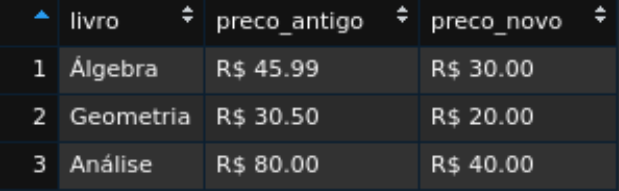
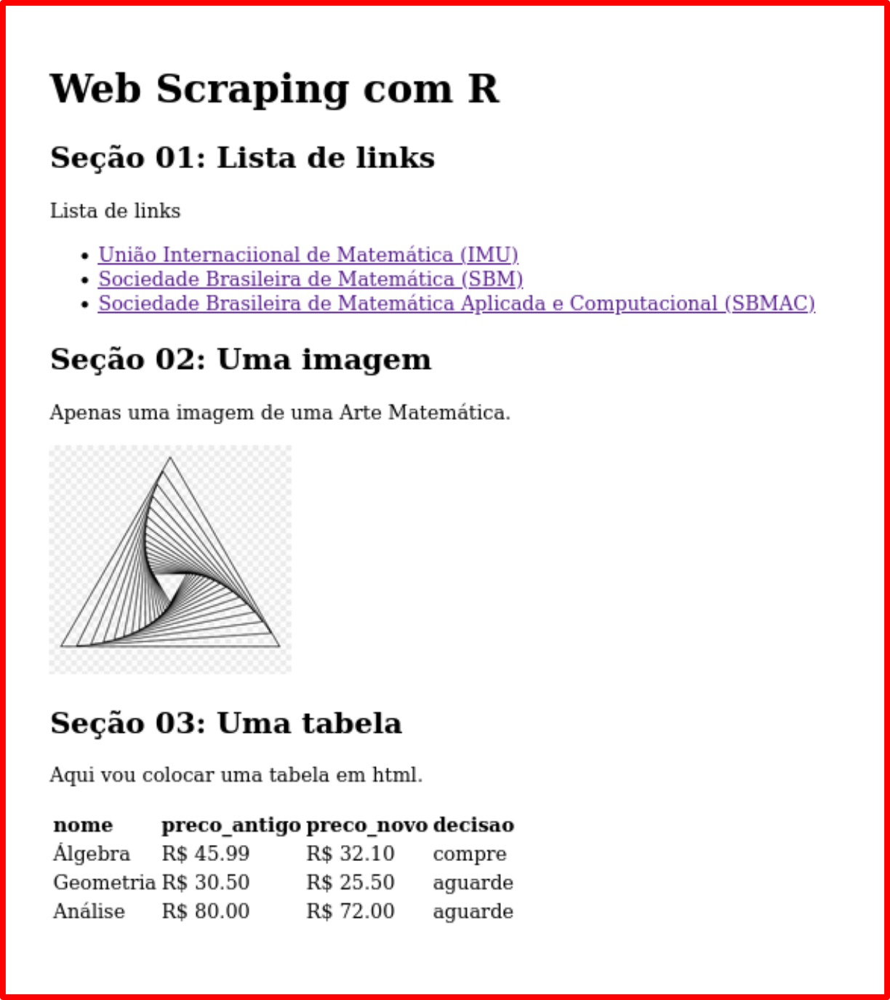

```{r setup, include=FALSE}
knitr::opts_chunk$set(echo = TRUE, message = FALSE)
xaringanExtra::use_panelset()
library(magrittr)
```


# 4. Algo a mais sobre o Tidyverse

## 4.1 O universo arrumado do tidyverse

Vimos que o `tidyverse` é um pacote do R que agrega pacotes com uma certa 
"filosofia", por exemplo, o modo de escrever as funções (geralmente com verbos
em inglês que remotam à característica dessa função).

São muitos os pacotes que compõem o `tidyverse` (30 pacotes). 
Podemos listá-los com o seguinte comando:

```{r}
tidyverse::tidyverse_packages()
```

Entretanto, usaremos, apenas, seis desses pacotes nesse minicurso:

- **readr**; usaremos a função `parse_double()` que, como o nome sugere, 
  passa um conjunto de caracteres para a categoria numérica. 
  Uma função do R Base que poderia fazer o mesmo papel seria `as.numeric()`.
  também usaremos a função `write_csv()`, para formarmos uma saída com arquivo 
  de extensão `csv`.
- **tibble**; para construirmos "tabelas" (`tibbles`) especiais e visualizarmos 
  o resultado.
- **dplyr**; para manipulação de dados (agrupar, selecionar, filtrar, arrumar, 
  etc., certas características desejadas nas `tibbles`)
- **stringr**; para manipulação de cadeias de caracteres, como frases, texto, 
  símbolos, etc. 
  É bem útil para "limpeza" dos dados coletados numa raspagem da internet (as 
  coisas, geralmente, não vem "arrumadinhas").
- **purrr**; para interações. Substitui as ideias das estruturas de repetições 
  (`loops`) na programação, como `for` ou `while`, por exemplo. 
- **rvest**; para raspagem de dados em documentos html. 
  É o principal pacote de nosso minicurso.

No que se refere à utilização desses pacotes, podemos escolher algumas arbordagens...

Uma delas é carregar todo o pacote `tidyverse`  na memória do computador.
Mas, isso carrega, apenas, uma parte dos pacotes, como vocês podem perceber ao
digitarmos:

```{r, message=TRUE}
library(tidyverse)
```

Note que foram carregados 8 (oito) pacotes:

```{r, fig.align='center', echo=FALSE, out.width='90%'}

```

E o `rvest` não está nessa lista.
Então, precisaremos carregá-lo também!

```{r, eval=FALSE}
library(tidyverse)
library(rvest)
```

Essa é uma abordagem válida e simplifica a escrita dos códigos, tornando-os menos
"verbosos".
Uma desvantagem, porém, é que, quando se é iniciante, nem sempre conhecemos de 
qual pacote pertence determinada função, o que pode atrapalhar os estudos.
Além, claro, de carregar a memória do computador com pacotes que não usaremos.

Dessa forma, podemos usar a seguinte abordagem (que usarei no minicurso):
não carregaremos o pacote todo (ou seja, não usaremos `library(nome-do-pacote)`),
mas as funções provenientes deles. 
Para isso, usaremos a seguinte nomenclatura:

```{r, eval=FALSE}
pacote::nome_funcao()
```

### 4.1.1 Uso dos pipes

A ideia do "pipe" (existem diversas traduções, mas a que me faz comprender a ideia 
é a de “tubo”, como em uma “encanação”: você conecta as coisas) é, basicamente, 
escrever o encadeamento do código como pensamos; bem como escrevê-lo em etapas 
sutilmente delimitadas, trazendo clareza em cada linha de código.

O tidyverse, por meio do pacote `magrittr`, disponibiliza o pipe `%>%`, que pode
ser acessado por meio do comando `Ctrl + Shift + M`.

Para entendermos um pouco mais sobre o `%>%`, lembremos das funções compostas. 
Ao compormos três funções, por exemplo, escrevemos:

\[
  h(g(f(x)))
\]

Resolvemos, então, de “dentro” para “fora” da expressão, ou seja, calculamos 
$f(x)$, depois $g(f(x))$ e, por fim $h(g(f(x)))$.

Mas, nosso raciocínio é mais ou menos assim:

1. "pegue o $x$, **então**
2. aplique em $f()$, **então**
3. aplique em $g()$, **então**
4. aplique em $h()$.

Podemos expressar esse mesmo pensamento usando o `%>%`, da seguinte forma:

```{r, eval=FALSE}
x %>% f() %>% g() %>% h()
```

Ou, na prática, escrevemos assim:

```{r, eval=FALSE}
x %>% 
  f() %>% 
  g() %>% 
  h()
```

Onde $x$ representa, geralmente, algum conjunto de dados (dataset) ou conjunto 
de caracteres; e, as funções $f$, $g$, $h$ são algumas das funções dos pacotes 
do tidyverse.

Por exemplo, suponha que num `site` leia-se o código *html*, usando a função
`read_html()`; extraia-se os elementos da *tag* `a`, usando a função 
`html_elements()`; e, por fim, extraia-se o atributo que armazena os *hiperlinks*
("href"), com a função `html_attr()`.

A sequêcia dos códigos ficaria assim:

```{r, eval=FALSE}
site |> 
  rvest::read_html() |> 
  rvest::html_elements("a") |> 
  rvest::html_attr("href")
```

Ôpa! 
O pipe não era `%>%`? 
Por que apareceu `|>`?

O pipe introduzido pelo tidyverse foi tão bem aceito, que o próprio R Base decidiu
implementar um.
O pipe `|>` é mais rápido do que o `%>%`, porém, se precisarmos passar dois 
argumentos numa mesma função, o pipe `%>%`  é mais conveniente.

> Logo, podemos usar de forma indiscriminada qualquer dos pipes, desde que seja
conveniente para os fins que desejamos. 
> Em especial, nesse minicurso, daremos preferência ao uso do pipe base, `|>`.
> Só usaremos o pipe do `magrittr`, `%>%`, se houver a necessidade de passarmos
dois argumentos numa mesma função.

No RStudio Cloud, por padrão, vem o pipe `%>%`.
Você não precisa alterar nada para acompanhar o minicurso!

## 4.2 Pacotes que usaremos

Vamos, agora, falar um pouco sobre as funções que usaremos nesse minicurso, 
contextualizando-as em seus respectivos pacotes.

### 4.2.1 tibble

Uma `tibble` é um `data frame` (do R Base) melhorado.
Grosso modo, é uma tabela muito especial.
Com ela, podemos organizar os dados de uma forma que facilite a manipulação dos
mesmos pelos pacotes do tidyverse e para o processamento no computador.
Para quem possuir interesse, o formato da `tibble` em questão é o
[tidy](https://vita.had.co.nz/papers/tidy-data.html), onde cada coluna representa
uma *variável*; cada linha, uma *observação*; e, em cada célula há *apenas* uma
observação.

Para nossos fins, basta saber como formar uma `tibble` e como visualizá-la.

A função `tibble()`, do pacote de mesmo nome, `tibble`, cria a tabela desejada.
A estrutura dessa função segue o formato:

```{r, eval=FALSE}
tibble::tibble(
  var_1 = ...,
  var_2 = ...,
  ...
  var_n = ...
)
```

Por exemplo, suponha que desejamos construir uma tabela com três variáveis:
`livro`, `preco_antigo` e `preco_novo`.
Podemos construir uma `tibble` com:

```{r}
tabela_livros <- tibble::tibble(
  livro = c("Álgebra", "Geometria", "Análise"),
  preco_antigo = c("R$ 45.99", "R$ 30.50", "R$ 80.00"),
  preco_novo = c("R$ 32.1", "R$ 25.50", "R$ 72.00")
)

tabela_livros
```

Notem que a visualização é feita no console do RStudio.
Caso queiramos uma visualização mais aprimorada, podemos usar a função `view()`,
da seguinte forma:

```{r}
tabela_livros |> tibble::view()
```

A saída assemelha-se a isso (só dá para visualizar no RStuido):

```{r, echo=FALSE, fig.align='center'}

```

### 4.2.2 readr

O `readr` possui funções direcionadas para leitura de dados (`csv`, `tsv` e `fwf`).
Todavia, existe uma função, que usaremos em determinadas passagens, para transformar
a classe dos dados para **numérica** (*numeric* ou *double*).

O nome dessa função é **parse_double()**.

Vejamos um exemplo.

Suponha que numa extração de dados da *web*, os valores de três livros fossem 
classificados como "character", mas, obviamente, gostaríamos que eles fossem 
"numeric".

```{r}
valores_web <- c("20.2", "30.1", "23.5")

class(valores_web)
```
Para transformar esses valores para dados numéricos, usamos:

```{r}
valores_num <- valores_web |> 
  readr::parse_double()
```

Transformamos e salvamos na variável `valores_num`.
Ao verificarmos a classe, percebemos que os dados passaram a ser numéricos:

```{r}
class(valores_num)
```

Dentro desse mesmo pacote há a função `write_csv()`.
Ela possui a seguinte estrutura:

```{r, eval=FALSE}
write_csv(variavel-formada, "caminho/nome-com-extensao.csv")
```

Onde, `variavel-formada` é algum objeto (_data-frame_, por exemplo) que você 
atribuiu à alguma variável e deseja salvar em `.csv`; e, `"caminho/nome-com-extensao"` 
(notem as aspas!) é o caminho relativo que deseja-se "escrever" esse arquivo no 
disco.

Por exemplo, suponha que nosso objetivo seja salvar a `tibble` **tabela_livros** 
no diretório `downloads` (dentro de sua área de trabalho no R).
Basta, então, fazermos:

```{r, eval=FALSE}
write_csv(tabela_livros, "downloads/tabela-livros.csv")
```

Note que dei o mesmo nome "tabela_livros" ao arquivo formado.

### 4.2.3 dplyr

O pacote [dplyr](https://dplyr.tidyverse.org/) fornece uma estruturação de funções
que seguem uma certa "gramática de manipulação de dados". 
Isso fornece um conjunto consistente de "verbos" (os nomes das funções são verbos
, em Inglês, que lembram a sua utilidade) que resolvem os desafios mais comuns 
na manipulação de dados.

É um pacote fabuloso e que precisaríamos de um curso só para falar dele.

Como o objetivo desse minicurso é sobre Web Scraping, a manipulação dos dados
estará contida no processo.
Entretanto, manipularemos conjuntos de caracteres e não necessariamente "tibbles".
Portanto, só usaremos algumas poucas funções desse pacote.

Uma delas é a função **mutate()**.

Em inglês, numa tradução livre, a palavra *mutate* refere-se a "mudança", 
"alteração", etc.
Portanto, usaremos a função `mutate()` se desejamos fazer uma modificação na
tibble (usamos `dplyr` apenas em tibbles).

Para exemplificar, considere a seguinte tabela (modificamos a tabela anterior 
para que as variáveis fossem numéricas):

```{r}
tabela_livros_mod <- tibble::tibble(
  livro = c("Álgebra", "Geometria", "Análise"),
  preco_antigo = c(45.99, 30.50, 80.00),
  preco_novo = c(32.1, 25.50, 72.00)
)
```

Se quisermos acrescentar uma variável que calcula a diferença entre o "preço novo" 
(`preco_novo`) e o "preço antigo" (`preco_antigo`) precisamos usar o `mutate`.
Ela acrescentará uma nova variável (que daremos o nome `diferenca`) à `tabela_livros_mod`.

```{r}
tabela_livros_completa <- tabela_livros_mod |> 
  dplyr::mutate(
    diferenca = preco_novo - preco_antigo
  )

tabela_livros_completa
```

> Observe que, para fazer sentido a diferença entre os valores, estes devem ser
numéricos!

Agora, suponha que desejamos criar uma nova variável que estabeleça uma 
"tomada de decisão".
Se o "preço novo" for 30% mais barato do que o "preço antigo", deseja-se que apareça 
a mensagem "compre".
Caso contrário, deseja-se que apareça a mensagem "aguarde".

Para isso, como podemos notar, precisamos usar uma estrutura "if ..., else", ou
seja, "se ocorre '*condição A*', então '*faça B*'; caso contrário, '*faça C*'".

O `dplyr` fornece uma função para isso: `if_else(cond., caso-verdade, caso-contrário)`.

- No argumento `cond.`, colocamos a condição desejada;
- No argumento `caso-verdade`, colocamos a mensagem caso a condição desejada seja
  verdadeira;
- No argumento `caso-contrário`, colocamos  a mensagem caso a condição inicial 
  não seja satisfeita.

Portanto, o código fica assim:

```{r}
tabela_livros_decisao <- tabela_livros_mod |> 
  dplyr::mutate(
    decisao = dplyr::if_else(
      preco_novo <= 0.7 * preco_antigo, "compre", "aguarde"
    )
  )

tabela_livros_decisao
```

### 4.2.4 rvest

Esse é o principal pacote que usaremos para o *web scraping*.
Ele será responsável por "ler" os códigos html que cada página dispõe, extraindo 
os "elementos" que desejamos.

Abordaremos, de forma direta, algumas das funções desse pacote.
Para isso, vamos usar como exemplo o seguinte texto em html:

```{r,eval=FALSE}
<html>
  <head>
    <title>Web Scraping</title>
  </head>
  <body>
    <h1>Web Scraping com R</h1>
    <h2>Seção 01: Lista de links</h2>
      <p>Lista de links </p>
      <ul>
        <li><a href='https://www.mathunion.org/'> União Internacional de Matemática (IMU)</a></li>
        <li><a href='https://sbm.org.br/'> Sociedade Brasileira de Matemática (SBM)</a></li>
        <li><a href='https://www.sbmac.org.br/'> Sociedade Brasileira de Matemática Aplicada e Computacional (SBMAC)</a></li>
      </ul>
    <h2>Seção 02: Uma imagem</h2>
    <p>Apenas uma imagem de uma Arte Matemática.</p>
    <p align='center'>
    
    </p>
    <h2>Seção 03: Uma tabela</h2>
    <p> Aqui vou colocar uma tabela em html.</p>
    <table>
      <tr>
        <td><b>nome</b></td>
        <td><b>preco_antigo</b></td>
        <td><b>preco_novo</b></td>
        <td><b>decisao</b></td>
      </tr>
      <tr>
        <td>Álgebra</td>
        <td>R$ 45,99</td>
        <td>R$ 32,10</td>
        <td>compre</td>
      </tr>
      <tr>
        <td>Geometria</td>
        <td>R$ 30,50</td>
        <td>R$ 25,50</td>
        <td>aguarde</td>
      </tr>
      <tr>
        <td>Análise</td>
        <td>R$ 80,00</td>
        <td>R$ 72,00</td>
        <td>aguarde</td>
      </tr>
    </table>
  </body>
  
</html>
```

Ele está diponível (o código, não a saída) no link abaixo:

<p align='center'>
  <a src='https://git.io/JMTRO'> https://git.io/JMTRO </a>
</p>

O link dese site foi reduzido, usando o encurtador [https://git.io/](https://git.io/),
do GitHub.
Mas, geralmente, os links podem vir bem extensos.
Para simplificar essa situação, atribuímos à variável `site` a url que desejamos
analisar (veja que salvamos **entre aspas**, ou seja, em formato de caracteres):

```{r}
site <- "https://git.io/JMTRO"
```

A saída desse código é dada a seguir:

```{r, fig.align='center', echo=FALSE}

```

O primeiro passo é fazer com que o R "leia" (importe) os dados do html para a 
memória do computador (ou, no caso desse minicurso, para o servidor do RStudio 
Cloud).
Fazemos isso com a função **read_html()**.

Nesse ponto, cabe uma consideração: geralmente extraimos mais de um elemento de
uma página web, mas a leitura do html é a mesma.
Portanto, salvar esse passo inicial em alguma variável é conveniente.
Vamos denominar essa variável por **site_base**.

O código fica assim:

```{r}
site_base <- rvest::read_html(site)

site_base
```

Notem que o documento possui duas partes: **head** e **body**.
Como vimos, o que precisamos, encontra-se na *tag* **body**.
Antes de prosseguirmos, retorne ao código em html e procure encontrar *tags* como
"h1, h2, ...", "a", "p", "img", "table", etc.

Suponha que desejamos extrair a tabela dessa página de exemplo.
A função para isso é **html_table()**.

```{r}
tabela <- site_base |> 
  rvest::html_table()

tabela
```
A saída é uma `tibble` pronta para ser manipulada (você pode estudar sobre o 
`dplyr` pra isso)!
Mas, o "cabeçalho" dessa tabela não ficou como desejamos: a segunda linha deveria
ser esse cabeçalho.

Você pode usar o argumento `header = TRUE`, na função `html_table()` para que 
a extração da tabela seja adequada aos nossos fins.

```{r}
tabela <- site_base |> 
  rvest::html_table(header = TRUE)

tabela
```

E se nosso objetivo fosse extair os elementos que contém os links e textos que 
estão na "Seção 01: ..."?
Ora, vimos que os links encontram-se na *tag* "a" (de *anchor*, ou seja, âncora).
Então, nada mais adequado do que extraírmos esse elemento.
Para isso, usamos a função **html_elements()**

```{r}
site_base |> 
  rvest::html_elements("a")
```

Aqui precisamos decidir ... 
Se quisermos extrair:

- a **url**; usamos a função **html_attr()**, com o atributo "href";
- o **texto**; usamos a função **html_text2()**.

```{r}
# extraindo todas as urls -----------------------------------------------------
site_base |> 
  rvest::html_elements("a") |> 
  rvest::html_attr("href")
```

```{r}
# extraindo o texto da tag "a" ------------------------------------------------
site_base |> 
  rvest::html_elements("a") |> 
  rvest::html_text2()
```

#### 4.2.4.1 Sobre o pacote httr

Quando tentamos extrair informações de alguns sites, certos erros de certificados
podem aparecer e os motivos são variádos (veja mais informações 
[aqui](https://br.godaddy.com/blog/erros-no-certificado-ssl/)).

Para sanar essa dificuldade, caso apareça algum erro de certificação SSL, devemos
colocar, antes da leitura do html, um comando que desativa a verificação dos
certificados SSL.
O pacote `httr` fornece a função `GET()`, para requisição da url e a função 
`config()`, para passarmos os parâmetros desejados (que, no nosso caso, seria 
**ssl_verifypeer = FALSE**, ou seja, não queremos verificar o certificado SSL).

Em resumo, coloque assim a linha de código (quando estiver atribuindo à variável
`site_base`):

```{r}
site_base <- site |> 
  httr::GET(httr::config(ssl_verifypeer = FALSE)) |> 
  rvest::read_html()
```
E todo o resto, faça como vimos anteriormente.

### 4.2.5 stringr

Esse pacote é essencial para limpeza dos dados.
Sim ... os dados não chegam para nós "arrumadinhos"!
Ao contrário, na maioria das vezes, os conjuntos de dados possuem caracteres não 
formatados, ou simplesmente não estão como desejamos organizar.

De fato, quando fazemos uma "raspagem de dados", estamos trabalhando com 
"fragmentos de textos".
Manipular esses fragmentos é fundamental para que as análises sejam realizadas
sem muitos "sustos" (geralmente não sai como desejamos quando, por exemplo, um
caractere especial está presente numa extração realizada).

Seremos diretos ao abordar as funções desse pacote, usadas nesse curso.
Antes, é interessante destacar que, tal como no pacote `rvest`, as funções do
pacote `stringr` seguem determinada estruturação.
Por exemplo, a maioria de suas funções começam com **str_** (no `rvest`, a maioria
começava com **html_**).

Para começarmos, considere a seguinte situação: desejamos extrair o preço dos
livros.

Ora, observando o código em html, vemos que a *tag* que nos ajudará nisso é a
**tb**.

```{r}
site_base |> 
  rvest::html_elements("td")
```
Bom ... tem coisa demais aí.
Quero o texto que se encontra entre as *tags*.
Então, usamos:

```{r}
site_base |> 
  rvest::html_elements("td") |> 
  rvest::html_text2()
```

Agora não temos mais funções do `rvest` para nos ajudar.
Precisamos manipular esses conjuntos de caracteres com o pacote **stringr**.

Como nosso objetivo é extrair os preços, percebemos que há um padrão: todos os
preços começam com "R$".
Há uma função no `stringr` que extrai uma sequência de caracteres que possui
determinado padrão.
É a função **str_subset()**.
Em seu argumento, colocamos, entre aspas, o padrão que desejamos.

Em nossa situação, cabe um detalhe: não adiantará (faça o teste) colocarmos 
`str_subset("R$")`, pois há um "caractere especial", a saber, "`$`".
Esse símbolo do cifrão é usado, no R, para fins específicos e, portanto, devemos
"escapar" o código na hora de escolhê-lo.
Fazemos isso com duas barras invertidas antes do cifrão.
Logo, devemos fazer: `str_subset("R\\$")`.
Assim:

```{r}
site_base |> 
  rvest::html_elements("td") |> 
  rvest::html_text2() |> 
  stringr::str_subset("R\\$")
```

Ótimo!
Mas, se desejamos apenas os valores numéricos, precisamos eliminar três caracteres: 
o "R", o "`$`" e o "espaço vazio"!).

A função **str_sub()** nos ajudará nessa questão.
Sua estrutura é dada por:

```{r, eval=FALSE}
stringr::str_sub(string, start = ..., end = ...)
```

Onde,

- *string*, é o conjunto de caracteres que estamos analisando;
- *start = ...*, é o ponto que iniciaremos a extração. 
  Devemos colocar aqui o número da posição do caractere que desejamos começar!
- *end = ...*, é o ponto que desejamos parar. 
  Se não colocarmos nada, subentende-se que iremos extrair até o final da *string*.

Portanto, como queremos eliminar os três primeiros caracteres, vamos iniciar a 
extração a partir do 4º caractere:

```{r}
site_base |> 
  rvest::html_elements("td") |> 
  rvest::html_text2() |> 
  stringr::str_subset("R\\$") |> 
  stringr::str_sub(4)
```

Muito bom, não?

Mas, ainda temos um problema: quando trabalhamos com valores numéricos, o 
separador decimal, por padrão, é o "ponto" e não a "vírgula".
Logo, seria importante subtituírmos todos os pontos por vírgula!
Fazemos isso com a função `str_replace_all()`.
Sua estruturação é:

```{r, eval=FALSE}
stringr::str_replace_all(string, "padrão", "substituição")
```

Onde:

- *string*, é o conjunto de caracteres analisado;
- *padrão*, é o caractere que deverá ser substituido;
- *substituição*, é o novo caractere que desejamos manter por padrão.

Em nosso caso, desejamos substituir a "vírgula" pelo "ponto", logo:

```{r}
site_base |> 
  rvest::html_elements("td") |> 
  rvest::html_text2() |> 
  stringr::str_subset("R\\$") |> 
  stringr::str_sub(4) |> 
  stringr::str_replace_all(",", ".")
```

Note que esse conjunto de dados não está ainda na forma numérica!
Sua classe ainda é "character".
Vimos que basta usarmos a função `parse_double()` do pacote `readr`:

```{r}
site_base |> 
  rvest::html_elements("td") |> 
  rvest::html_text2() |> 
  stringr::str_subset("R\\$") |> 
  stringr::str_sub(4) |> 
  stringr::str_replace_all(",", ".") |>
  readr::parse_double()
```

Com tudo o que vimos, já podemos fazer muitas coisas!
Mas, ainda precisamos falar sobre outras importantes funções desse pacote!

Uma situação que frequentemente acontece é colocarmos todas as letras em minúsculas.
A função **str_to_lower()** faz isso tranquilamente!

Para fins de exemplo, vamos colocar os nomes do texto que se encontra nos elementos
"a" em minúsculas.
Veja como fica o código:

```{r}
site_base |> 
  rvest::html_elements("a") |> 
  rvest::html_text2() |>
  stringr::str_to_lower()
```

Para exemplificar as duas últimas funções que usaremos desse pacote, considere
o seguinte conjunto de caracteres, denominado `livros_nome`:

```{r}
livros_nomes <- c(
  "Cálculo em uma Variável Complexa \n", 
  "introdução à álgrebra \r", 
  "Álgebra Linear \r"
)

livros_nomes 
```

Notem que há caracteres não desejáveis na extração: "`\r`" ou "`\n`".
Eles quebram a linha, colocando "espaços em branco" depois dos nomes).
Para eliminar esses "espaços em branco", usamos a função **str_trim()**.

```{r}
livros_nomes |> 
  stringr::str_trim()
```

Agora, vamos organizar as coisas ...
Vamos fazer o seguinte, pois retiramos os caracteres indesejados, mas os nomes 
não estão padronizados: 

1. colocar tudo em minúsculas;
2. retirar os espaços entre as palavras, substituindo-os por "traços" (-).
3. retirar a acentuação (com a função `iconv()`, do R Base).

O código fica assim:

```{r}
livros_nomes |> 
  stringr::str_trim() |> 
  stringr::str_to_lower() |>
  stringr::str_replace_all(" ", "-") |> 
  base::iconv(to = "ASCII//TRANSLIT")
```
Agora, suponha que desejamos colocar, no início de cada nome organizado de livros,
um padrão, por exemplo, "`livros-matematica_`".
Essa **concatenação**, ou justaposição de caracteres pode ser feita com a função
**str_c()**.
Assim, desejamos algo como: `str_c("livros-matematica_", .)`, onde "." representa
todas as expressões anteriores.

O código fica assim (note a mudança no pipe, para que seja mais simples mudar
o argumento para segunda posição):

```{r}
livros_nomes |> 
  stringr::str_trim() |> 
  stringr::str_to_lower() |>
  stringr::str_replace_all(" ", "-") |> 
  base::iconv(to = "ASCII//TRANSLIT") %>%
  stringr::str_c("livros-matemática_", .)
```
Temos, então, o suficiente do pacote `stringr` para nosso minicurso!

### 4.2.6 purrr

Por fim, mas não menos importante, precisamos de estruturas de *loops*.
De fato, quando efetuamos uma raspagem de dados que consiste, por exemplo, do
*download* de vários arquivos, a ideia é aplicar uma estrutura de repetição do
*download* de um deles, nos outros arquivos.

No R Base existem os "for" e "while" da vida, mas o pacote `purrr` torna isso 
tudo mais simples!

Para entendermos a usabilidade de certas funções do pacote `purrr`, vamos 
considerar duas categorias de arquivos: arquivo de texto (como *scripts* ".R");
e, arquivos binários (como, por exemplo, ".pdf").

```{r}
links_R <- c(
  "https://raw.githubusercontent.com/icaro-freire/scripts_exemplos/main/R/funcao_pi-ggplot.R",
  "https://raw.githubusercontent.com/icaro-freire/scripts_exemplos/main/R/funcao_pi.R",
  "https://raw.githubusercontent.com/icaro-freire/scripts_exemplos/main/R/funcao_primos.R",
  "https://raw.githubusercontent.com/icaro-freire/scripts_exemplos/main/R/grafico_apresentacao.R",
  "https://raw.githubusercontent.com/icaro-freire/scripts_exemplos/main/R/pontos-aleatorios_ggplot2.R"
)

links_pdf <- c(
  "https://sbm.org.br/wp-content/uploads/2021/10/Introducao-a-Geometria-Diferencial_Ronaldo-Freire-Lima.pdf",
  "https://sbm.org.br/wp-content/uploads/2021/10/Sistemas-Dinamicos-Lineares-Joao-Socorro-Pinheiro-Ferreira.pdf",
  "https://sbm.org.br/wp-content/uploads/2021/10/Teoria-de-Green-e-Escoamento-de-Poiseuille-Gilberlandio-Dias.pdf",
  "https://sbm.org.br/wp-content/uploads/2021/10/Topicos-na-intersecao-ente-a-Teoria-dos-Grafos-e-Algebra-Abel-Ortiz_Thiago-Moreira.pdf"
)

```

Antes de começarmos os downloads, vamos organizar nosso espaço de trabalho.

Uma coisa simples é criar um diretório para salvar os arquivos.
Podemos fazer isso de muitas formas, mas vamos usar uma função do pacote `fs`,
intitulada, **dir_create()**.
Isso será importante para criarmos uma variável com o mesmo nome do diretório 
onde salvaremos os arquivos; para que, possamos manipular adequadamente os 
argumentos da função `download.file()` dentro do `purrr`.

O nome do nosso diretório (pasta) será "download_arquivos":

```{r, eval=FALSE}
download_arquivos <- fs::dir_create("download_arquivos")
```

Agora, vamos relembrar como funciona a função `download.file()` fazendo o 
*download*, por exemplo, do primeiro arquivo ".R" de nossa lista, ou seja, o 
arquivo do link `links_R[1]`.

Para isso, precisamos de duas coisas: a url do link, que já sabemos como obter; 
e o destino junto com o nome desse arquivo, que, aliás, vamos deixar com o nome 
original.
Ora, a url é obtida fazendo `links_R[1]` e, como o nome desse arquivo é (tem que 
olhar o nome final do link) "funcao_pi-ggplot.R", podemos estabelecer o destino 
do download como: "download_arquivos/funcao_pi-ggplot.R", ou seja, dentro do
diretório "download_arquivos", vamos salvar um arquivo de extensão ".R", por 
nome "funcao_pi-ggplot".
O código ficaria assim:

```{r, eval=FALSE}
download.file(links_R[1], "download_arquivos/funcao_pi-ggplot.R")
```

Nesse ponto, já começamos perceber o quanto seria bom extraírmmos os nomes dos 
arquivos de forma rápida, sem precisar ver o nome "um por um"; pois, caso nossa
lista de link seja consideravelmente maior, ficaria inviável.

Portanto, ainda falando sobre organização, vamos extrair os nomes dos arquivos 
acima com o auxílio, mais uma vez, do pacote `fs`, já que a função **path_file()** 
faz esse serviço brilhantemente.

Podemos extrair o nome original dos arquivos ".R" com o comando:

```{r}
nomes_links_R <- fs::path_file(links_R)

nomes_links_R
```
E, para os arquivos ".pdf" assim:

```{r}
nomes_links_pdf <- fs::path_file(links_pdf)

nomes_links_pdf
```

Para nossos fins, vamos considerar até três argumentos da função `download.file()`,
dependendo do seu Sistema Operacional.
Quem usa GNU/Linux, só precisa de dois argumentos; mas, quem usa Windows, pode
precisar de três argumentos.

- **GNU/Linux**: `dowload.file(url, destfile)`
- **Windows**: `dowload.file(url, destfile, mode = "wb")`

O GNU/Linux consegue identificar os tipos de arquivos (texto ou binário) de forma
automática, mas o Windows não.
Para esse últuimo sistema operacional, os arquivos binários precisam ser
especificados com o argumento `mode = "wb"`.

Portanto, na parte do download dos arquivos ".pdf", vamos diferenciar as coisas.
Por enquanto, para arquivos de texto, vamos seguir de forma indistinta entre os
sistemas operacionais.

O código abaixo substitui o primeiro download realizado:

```{r, eval=FALSE}
download.file(links_R[1], download_arquivos/nomes_links_R[1])
```

Ok ... Mas, como seria para todos os downloads?
É aqui que entra o pacote `purrr`: a função **walk2()** nos ajudará nisso!
Ela possui a seguinte estruturação:

```{r, eval=FALSE}
purrr::walk2(arg1, arg2, função)
```

Ou seja, ela passa os dois argumentos para a função!
Em nosso exemplo, a função é `download.file` e os argumentos são: 

  - `arg1 = links_R`
  - `arg2 = download_arquivos/nomes_links_R`.
  
Portando, temos o seguinte código para obtermos o download de todos os arquivos
".R" listados:

```{r, eval=FALSE}
purrr::walk2(links_R, download_arquivos/nomes_links_R, download.file)
```

Agora, para download dos arquivos ".pdf", caso esteja no GNU/linux, fazemos:

```{r, eval=FALSE}
purrr::walk2(links_pdf, download_arquivos/nomes_links_pdf, download.file)
```

Mas, caso esteja no Windows, não poderemos usar mais a função `walk2`, pois ela
APENAS passas dois argumentos; todavia, agora, aparecerá um terceito: `mode = "wb"`.

Para três ou mais parâmetros, a função que estamos procurando é a **pwalk()**.
Ela possui a seguinte estrutura:

```{r, eval=FALSE}
purrr::pwalk(lista, função)
```

No argumento "lista" criaremos uma lista com todos os argumentos necessários para
a função.

Para nosso exemplo, uma lista adequada seria:

```{r, eval=FALSE}
lista_args <- list(links_pdf, download_arquivos/nomes_links_pdf, mode = "wb")
```

Portanto, o download de todos os arquivos ".pdf", no Windows, fica:

```{r, eval=FALSE}
purrr::pwalk(lista_args, download.file)
```

Todas as considerações acima, capacita-nos à raspagem dos dados!!!
