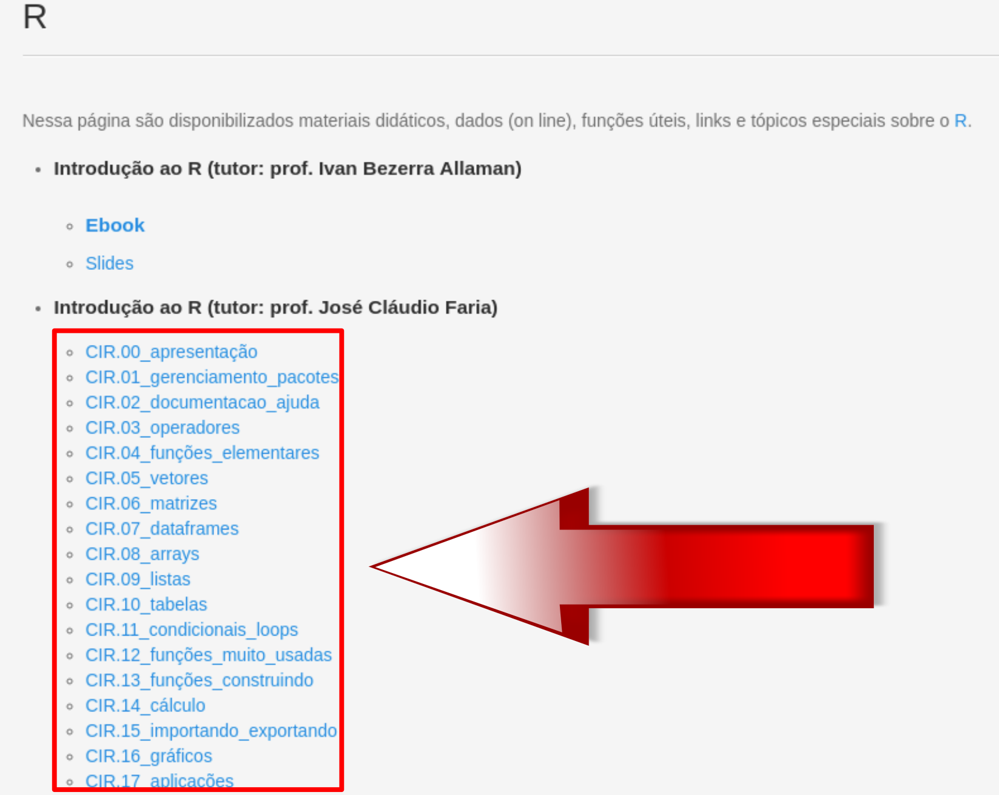
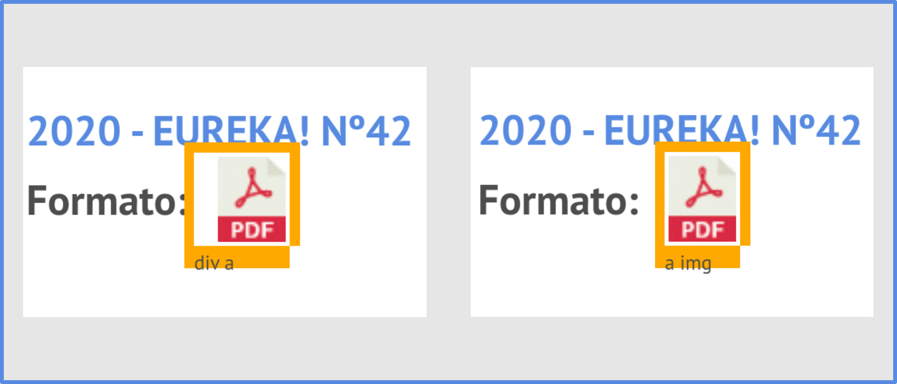

```{r setup, include=FALSE}
knitr::opts_chunk$set(echo = TRUE, message = FALSE)
xaringanExtra::use_panelset()
library(magrittr)
```

# 5. Web Scraping como uma ferramenta

Antes de iniciarmos nossos códigos, nunca é demais salientar que esse texto 
trata-se de uma introdução.
Coletar dados da *web* pode ser uma tarefa realmente árdua e desafiadora, pois
os sites podem dificultar o acesso de diversas formas.

Abordaremos situações simples, onde o web scraping realmente é usado como uma
ferramenta para aumentar a produtividade do professor, reduzindo seu tempo em
muitas situações que frequentemente aparecem na vida profissional.

Uma outra coisa impotante, antes de iniciarmos a prática, é sempre termos em 
mente que nossos códigos são estabelecidos em certo momento temporal, ou seja,
o código funciona "naquele momento" e esperamos que continue assim.

Mas, sites podem mudar e, consequentemente, o nosso código pode "quebrar".
Por isso, dependendo da época em que você esteja lendo esse texto, as coisas 
podem estar bem diferentes.
A idéia é você entender os fundamentos e aplicar numa situação particular que
deseja.

## 5.1 Ética no Web Scraping

Quando usamos um programa para extrair dados de um site, estamos fazendo requisições
ao servidor daquele site.
Obviamente, muitas requisições podem tornar lento um site e isso não é desejado 
por seus mantenedores.

Essa é uma das razões para que alguns sites **restrinjam** o acesso em determinada
área, ou da totalidade do site!

Por isso, conhecer as permissões de cada site é importantíssimo numa possível
"raspagem" de dados.

> Sempre leia as permissões do site, antes de iniciar qualquer atividade de web
scraping.

Uma das formas de sabermos se um site permite a raspagem é verificando os 
**robots.txt**.

Para isso, na url de cada site, ao final da mesma, digite: "/robots.txt".

Essa é uma condição necessária, mas não suficiente.
Alguns sites colocam restrições não nos robots.txt, mas em alguma seção do mesmo.
Por isso, se não aparecer nada no texto do robots.txt, pode ser que o site não o 
tenha.
Então, deve-se procurar informações sobre raspagem de dados no próprio site!

Por exemplo, no site da ANPMat (Associação Nacional dos Professores de Matemática
na Educação Básica), a saber:

<p align='center'>
  <a src='https://anpmat.org.br/'> https://anpmat.org.br/ </a>
</p>

Podemos verificar se "robôs" podem acessá-lo.
Para isso, digitamos:

<p align='center'>
  <a src='https://anpmat.org.br/robots.txt'> https://anpmat.org.br/robots.txt </a>
</p>

A seguinte mensagem aparece:

```{r, eval=FALSE}
# XML Sitemap & Google News version 5.2.7 - https://status301.net/wordpress-plugins/xml-sitemap-feed/
Sitemap: https://anpmat.org.br/sitemap.xml

User-agent: *
Disallow: /wp-admin/
Allow: /wp-admin/admin-ajax.php

Sitemap: https://anpmat.org.br/wp-sitemap.xml

```

Veja que a seção "wp-admin" não está hailitada para web scraping.

Uma outra questão, é quando envolve a raspagem de dados em muitas páginas.
Mas, o pacote [polite](https://dmi3kno.github.io/polite/) pode ser usado junto 
com o `rvest` e solucionar esse problema, visto que esse pacote respeitará as
requisições feitas em cada site.

Bom ... agora vamos à prática!

## 5.2 Fazendo download de vários arquivos

Uma das situações que comumente nos deparamos em nossa profissão é fazermos 
downloads de bons materiais disponíveis gratuitamente na internet.
Porém, se a lista de download for relativamente grande, fazer isso manualmente,
ou seja, clicar em cada um deles e salvar num determinado local ... pode ser 
tedioso.

Mas ... graças a Deus, exite o R!

### 5.2.1 Arquivos de texto

Para exemplificar o *dowload* de vários arquivos de texto, vamos acessar o link
da página do *Laboratório de Estatística Computacional -- LEC*, da UESC.
Na seção "Material Didático/R", estão disponíveis *scripts*, em R, sobre diversos
temas, dentre outras coisas.

> **O que desejamos fazer?** . Essa pergunta sempre deve ser nosso norte, antes de 
  iniciarmos a raspagem dos dados!

Nosso objetivo, nesse exemplo, é fazer o *download* dos 18 arquivos que se 
encontram na seção "Introdução ao R (tutor: prof. José Cláudio Faria)", 
etiquetados como: "CIR.00_apresentação", "CIR.01_gerenciamentos_pacotes", ..., 
"CIR.17aplicações".
Como na figura abaixo:

```{r, fig.align='center', echo=FALSE}

```

Agora, vamos atribuir à variável **url_uesc** o link da url em questão:

```{r}
url_uesc <- "https://lec.pro.br/avale-es/r"
```

E, à variável **site_uesc** o html extraído com a função `read_html()`, do pacote
`rvest`:

```{r}
site_uesc <- rvest::read_html(url_uesc)
```

Estamos prontos para a manipulação desses dados!

Com a ajuda do *SelectorGadget*, selecionamos o elemento que desejamos raspar e,
depois, fazemos os ajustes necessários (até ficar em amarelo o que desejamos, da
menor forma possível).

Abaixo, o código mostra que o elemento CCS "li:nth-child(2) h5+ ul a"

```{r}
site_uesc |> 
  rvest::html_elements("li:nth-child(2) h5+ ul a")
```

Obviamemte o elemento CCS pode mudar um pouco.
Dependenderá muito da seleção que você fez.
Por exemplo, se não fossem feitos os ajustes, a *tag* "a" serviria normalmente.
O problema dessa abordadem é que existem muitas outras *tags* "a" espalhadas pelo
site que não nos interessa.

Feito isso, precisamos extrair desses elementos os *links* de cada arquivo.
O atributto "href" nos dará isso.
Então, basta usarmos a função `rvest::html_attr("href")`:

```{r}
site_uesc |> 
  rvest::html_elements("li:nth-child(2) h5+ ul a") |> 
  rvest::html_attr("href")
```

Antes de prosseguirmos note um certo "padrão" que aparece nos links desejados.
Por exemplo, antes do nome dos arquivos que desejamos extrair, podemos observar
a repetição dos caracteres "**CIR.**".
Isso seria importante se a nossa seleção abrangesse mais arquivos além do exposto.
Se isso ocorresse, poderíamos usar uma função do pacote `stringr` para 
selecionarmos esse padrão específico: **stringr::str_subset("CIR.")**.
Mas, como a nossa seleção foi bem exitosa, afinal extraiu o que desejávamos, não
usaremos essa função em nosso *script*.

Nesso momento, também é importante notar que, se clicarmos diretamente em algum 
dos links desejados, aparecerá uma parte da *url*, a saber, "https://lec.pro.br", 
que não se encontra no conjunto acima listado.

Para inserirmos essa parte da url, ANTES dos itens da lista acima, usaremos a
função **str_c()**, do pacote `stringr`.
Veja o código abaixo (note que usamos o pipe `%>%`, pois passaremos o argumento
anterior na SEGUNDA posição):

```{r}
site_uesc |> 
  rvest::html_elements("li:nth-child(2) h5+ ul a") |> 
  rvest::html_attr("href") %>% 
  stringr::str_c("https://lec.pro.br", .)
```

O que precisamos, agora, é fazer o *download*.
Antes, porém, vamos salvar na variável **links_uesc** a lista extraída acima.

```{r}
links_uesc <- site_uesc |> 
  rvest::html_elements("li:nth-child(2) h5+ ul a") |> 
  rvest::html_attr("href") %>% 
  stringr::str_c("https://lec.pro.br", .)
```

Estamos quase prontos para fazerrmos o *download* dos arquivos.
Entretanto, vamos organizar as coisas ...

Por exemplo, quando fizermos o *download*, qual será o nome dos arquivos?
Poderíamos criar uma lista com o nome que desejarmos, mas, por hora, vamos deixar
os nomes que já estão no final de cada link, pois possui certo padrão: 
  
  - `CIR.n_nome-do-arquivo.R`, onde $n$ varia de 00 até 17.
  
Mas, como extrair esses nomes?

Para responder essa pergunta, vamos usar um pacote chamado `fs` (*file system*).
Ele possui uma função denominada **path_file()**, que faz justamente o que 
precisamos.
Podemos, então, salvar numa variável **nomes_links_uesc** tais nomes:

```{r, eval=FALSE}
nomes_links_uesc <- fs::path_file(links_uesc)
```

Vimos que a função `download.file()` precisa de dois argumentos para fazer o 
*download* de um arquivo de texto plano: o *link* e o caminho para salvar o arquivo.
Já temos o *link* e, para não fazermos manualmente a criação de diretórios para
salvar os arquivos, vamos usar uma outra função do pacote `fs`: **dir_create()**.
Nela vamos escrever o caminho onde queremos salvar os arquivos, juntamente com
a lista dos nomes.

Como, nesse minicurso, faremos download de vários arquivos, vamos criar um
diretório mais geral, denominado **download_arquivos/**, onde serão salvos os 
arquivos dos sites específicos estudados.

Por exemplo, para os arquivos desse site da UESC, criaremos um subdiretório por 
nome "arquivos_uesc/".
Vamos atribuir à variável **arquivos_uesc** todo esse procedimento (note que
o nome da variável é o mesmo nome da pasta onde salvaremos os arquivos desse site). 
O código fica assim:

```{r, eval=FALSE}
arquivos_uesc <- fs::dir_create("download_arquivos/arquivos_uesc")
```

Por fim, vamos iterar o download para todos os 18 arquivos, usando o pacote
`purrr`, por meio da função **walk2()**:

```{r, eval=FALSE}
purrr::walk2(links_uesc, arquivos_uesc/nomes_links_uesc, download.file)
```

Maravilha, não?

Você pode conferir o *script* completo abaixo:

<details>
  <summary>
    Script para download dos arquivos, em R, disponíveis no site da UESC
  </summary>
  
```{r, eval=FALSE}
#==============================================================================
# Raspando material sobre R
# Ícaro Vidal Freire
# data de acesso: 2021-12-19
#==============================================================================

# pacote usado ------------------------------------------------------------
library(magrittr)

# url do site -------------------------------------------------------------
url_uesc <- "https://lec.pro.br/avale-es/r"

# site para scraping ------------------------------------------------------
site_uesc <- rvest::read_html(url_uesc)

# raspando os materiais ---------------------------------------------------
links_uesc <- site_uesc |> 
  rvest::html_elements("li:nth-child(2) h5+ ul a") |> 
  rvest::html_attr("href") %>% 
  stringr::str_c("https://lec.pro.br", .)

# preparando para download ------------------------------------------------
arquivos_uesc <- fs::dir_create("download_arquivos/arquivos_uesc")
nomes_links_uesc <- fs::path_file(links_uesc)

# fazendo o download ------------------------------------------------------
purrr::walk2(links_uesc, arquivos_uesc/nomes_links_uesc, download.file)

#==============================================================================
```
  
</details>

### 5.2.2 Arquivos binários

Nessa seção, vamos fazer o download de arquivos binários no formato `pdf`.
O site onde se encontram esses arquivos é o da *Olimpíada Brasileira de Matemética* 
(OBM), especificamente na área da Revista Eureka:

<p align='center'>
  <a href='https://www.obm.org.br/revista-eureka/'> 
    https://www.obm.org.br/revista-eureka/
  </a>
</p>

Nosso objetivo é fazer o download das 42 revistas, no formato `pdf`, e organizar
esses arquivos com nomes seguindo determinado padrão.

O primeiro passo é fazer a leitura do site.
Antes, porém, vamos atribir à variável `url_eureka` o link do site:

```{r}
url_eureka <- "https://www.obm.org.br/revista-eureka/"
```

Prosseguimos, então, com a leitura, atribuindo à variável `site_eureka` seu 
resultado:

```{r}
site_eureka <- rvest::read_html(url_eureka)
```

Feito isso, precisamos dos elementos que contém os links que desejamos para 
download.
A seleção do CSS ajuda-nos a delimitar as opções adequadamente.

Entretanto, nesse ponto, perceba uma sutil diferença ao clicar sobre a imagem
de algum arquivo do pdf e num pequeno espaço, ao seu lado.
Para ser mais claro, vamos considerar o link associado à Revista nº 42:

```{r, echo=FALSE}

```

Obviamente, o link que será extraído não se encontra na *tag* de "img".
Portanto, devemos clicar num pequeno espaço ao lado dessa imagem de pdf e depois
fazermos os ajustes, clicando novamente nos itens que não nos interessa no momento,
como por exemplo, nos links do cabeçalho da página.

Com o passo acima, um elemento CSS possível seria: "#revistas-list a".
Logo, podemos extrair os links assim:

```{r, eval=FALSE}
site_eureka |> 
  rvest::html_elements("#revistas-list a") |> 
  rvest::html_attr("href")
```


```{r, echo=FALSE}
site_eureka |> 
  rvest::html_elements("#revistas-list a") |> 
  rvest::html_attr("href") |> 
  utils::head(10)
```

Mas, para selecionarmos apenas o formato pdf, usamos: `stringr::str_subset(".pdf")`.
Vamos atribuir à variável `links_eureka` esses procedimentos:

```{r}
links_eureka <- site_eureka |> 
  rvest::html_elements("#revistas-list a") |> 
  rvest::html_attr("href") |> 
  stringr::str_subset(".pdf")
```

Se visualizarmos os nomes desses links, notaremos que não há um padrão único.
Para contornar isso, vamos criar uma lista com 42 nomes com o seguinte padrão:

- `n_eureka`; onde $n$ é um número que varia de 1 a 42.

Uma maneira de criar essa sequência de números é usarmos a função `seq()`, do
R Base:

```{r}
seq(1, 42)
```

Mas, vamos estabelecer que nosso padrão contenha sempre dois dígitos.
Então, para os algarísmos de 1 até 9, colocaremos o número 0 (zero) à esquerda 
deles.
Dessa forma, basta aglutinarmos o caractere "0" à sequência `seq(1, 9)`. 
A função `str_c()`, do pacote **stringr**, é adequada para isso:

```{r}
stringr::str_c("0", seq(1, 9))
```

Todavia, vamos concatenar esse resultado com os números restantes (de 10 a 42),
atribuindo à variável `index` (pois é uma indexação) esse procedimento:

```{r}
index <- c(stringr::str_c("0", seq(1, 9)), seq(10, 42))
```

Portanto, para criarmos a lista com 42 nomes padronizados, vamos aglutinar à
indexação o padão "_eureka", atribuindo à variável `nomes_eureka` esses 
procedimentos:

```{r}
nomes_eureka <- stringr::str_c(index, "_eureka")

nomes_eureka
```

Como já vimos, para criar um subdiretório, por nome "arquivos_eureka", no diretório `download_arquivos`, usamos a função `dir_create`, do pacote **fs**.
Atribuindo esse passo à variável `arquivos_eureka`, temos:

```{r, eval=FALSE}
arquivos_eureka <- fs::dir_create("downloads/arquivos_eureka")
```

Estamos quase aptos a realizar o dowload de tudo!
Basta, criarmos a lista de argumentos para os parâmetros da função `pwalk()`:

```{r, eval=FALSE}
eureka_args <- list(links_eureka, arquivos_eureka/nomes_eureka, mode = "wb")
```

Por fim, podemos iterar esse procedimento para todos os arquivos com:

```{r, eval=FALSE}
purrr::pwalk(eureka_args, download.file)
```


Você pode conferir o *script* completo abaixo:

<details>
  <summary>
    Script para download de arquivos, em pdf, da Revista Eureka
  </summary>
  
```{r,eval=FALSE}
#==============================================================================
# Download das revistas Eureka
# Ícaro Vidal Freire
# data de acesso: 2021-11-26
#==============================================================================

# url do site -------------------------------------------------------------
url_eureka <- "https://www.obm.org.br/revista-eureka/"

# preparação do site ------------------------------------------------------
site_eureka <- rvest::read_html(url_eureka)

# raspagem dos dados ------------------------------------------------------
## extraindo links
links_eureka <- site_eureka |> 
  rvest::html_elements("#revistas-list a") |> 
  rvest::html_attr("href") |> 
  stringr::str_subset(".pdf")

## modificando os nomes
index <- c(stringr::str_c("0", seq(1, 9)), seq(10, 42))
nomes_eureka <- stringr::str_c(index, "_eureka")

## criando os diretórios e caminhos
arquivos_eureka <- fs::dir_create("downloads/arquivos_eureka")

## preparando os argumentos para download
eureka_args <- list(links_eureka, arquivos_eureka/nomes_eureka, mode = "wb")

# fazendo os downloads ----------------------------------------------------
purrr::pwalk(eureka_args, download.file)

#==============================================================================
```
  
</details>


### 5.2.3 Raspando tabelas

A função do pacote **rvest** para raspar uma tabela é `html_table()`.

Para exemplificarmos seu uso, consideremos a seguinte página da Wikipédia sobre
a linguagem de programação R:

<p align='center'>
  <a href='https://pt.wikipedia.org/wiki/R_(linguagem_de_programa%C3%A7%C3%A3o)'>
    https://pt.wikipedia.org/wiki/R_(linguagem_de_programa%C3%A7%C3%A3o)
  </a>
</p>

Aparentemente, a única tabela existente na página é a da seção "Versão".

Diretamente, poderíamos fazer:

```{r}
# url do site -----------------------------------------------------------------
url_wiki <- "https://pt.wikipedia.org/wiki/R_(linguagem_de_programa%C3%A7%C3%A3o)"

# leitura do site -------------------------------------------------------------
site_wiki <- rvest::read_html(url_wiki)

# extração da tabela ----------------------------------------------------------
tabelas <- rvest::html_table(site_wiki)

# exibindo o conteúdo ---------------------------------------------------------
tabelas
```

Para nossa surpresa há 9 tabelas nessa página!
Quem a escreveu usou do formato da tabela para organização das informações, mas
em apenas uma colocou elementos característicos de um quadro.

Veja que a classe do objeto "tabelas" é uma lista:

```{r}
class(tabelas)
```

Ainda analisando essa lista, percebemos que a tabela que desejamos encontra-se 
na 5º posição.
Portanto, podemos selecioná-la da seguinte maneira:

```{r}
tabela_wiki <- tabelas[[5]]

tabela_wiki
```

Poderíamos simplificar os passos da seguinte forma:

```{r, eval=FALSE}
# carregando pacote -----------------------------------------------------------
library(magrittr)

# url do site -----------------------------------------------------------------
url_wki <- "https://pt.wikipedia.org/wiki/R_(linguagem_de_programa%C3%A7%C3%A3o)"

# lendo e raspando os dados ---------------------------------------------------
tabela_wiki <- url_wki |> 
  rvest::read_html() |> 
  rvest::html_table() %>%
  .[[5]]

# exibindo a tabela -----------------------------------------------------------
tabela_wiki
```

## 5.3 Construindo uma tabela para tomada de decisão

No site da livraria da USP, na seção "ASSUNTOS", ao escolhermos "Matemática", 
somos direcionados para essa página:

<p align='center'>
  <a href='https://www.edusp.com.br/loja/assuntos/21/matematica'>
    https://www.edusp.com.br/loja/assuntos/21/matematica
  </a>
</p>

Há uma lista de 19 livros (acesso em 23/12/2021), mas suponha que nosso objetivo 
seja acompanhar a variação do preço de três deles:

- Números: Uma Introdução à Matemática;
- Um Poeta, um Matemático e um Físico;
- Programação Matemática para Otimização de Processos.

Ainda mais: se o desconto dado pelo site for igual ou superior a 20% do valor do
livro, gostaríamos que uma tabela fosse exibida com alguma informação direta, como
por exemplo, "compre"; e, caso contrário, "aguarde".

Portanto, precisamos extrair:

- Os nomes dos livros;
- Os preços que estão na categoria "De ...";
- Os preços que estão na categoria "Por ...";
- Uma lista espacífica que desejamos comparar (a nossa lista com os três livros);
- Alguma condição para devolver os termos "compre" ou "aguarde.

Vamos fazer isso passo a passo, mas antes de começarmos, é importante organizarmos
as coisas:

```{r, eval=FALSE}
# url do site -----------------------------------------------------------------
url_usp <- "https://www.edusp.com.br/loja/assuntos/21/matematica"

# lendo o site ----------------------------------------------------------------
site_usp <- url_usp |> 
  rvest::read_html()
```

```{bash, eval=FALSE}
Error in open.connection(x, "rb") : 
  SSL certificate problem: unable to get local issuer certificate
```


Notem que houve um problema de Certificado de SSL.
Vimos que, para contornar isso, retiramos a verificação do certificado 
(`ssl_verifypeer = FALSE`) com a função `config()`, do pacote **httr**, dentro 
da função `GET()`, do mesmo pacote; sendo tudo isso ANTES do `read_html()`:

```{r}
# url do site -----------------------------------------------------------------
url_usp <- "https://www.edusp.com.br/loja/assuntos/21/matematica"

# lendo o site ----------------------------------------------------------------
site_usp <- url_usp |> 
  httr::GET(httr::config(ssl_verifypeer = FALSE)) |> 
  rvest::read_html()
```

### 5.3.1 Extraindo os nomes dos livros

Utilizando o SelectorGadget, clicamos sobre um dos títulos do livro e fazemos os
ajustes necessários (aparecerão elementos no rodapé da página do site que não são
convenientes).
Com isso, um possível CSS é: "#dvProdutos p".

```{r}
site_usp |> 
  rvest::html_elements("#dvProdutos p")
```

Queremos extrair os nomes dos livros.
Logo, interessa-nos o texto entre a tag `<p>`; e, para isso, usamos a função 
`text2()`:

```{r}
site_usp |> 
  rvest::html_elements("#dvProdutos p") |> 
  rvest::html_text2()
```

E, para retirar os caracteres indesejados de espaçamento, usamos a função 
`str_trim()`, do pacote **stringr**:

```{r}
site_usp |> 
  rvest::html_elements("#dvProdutos p") |> 
  rvest::html_text2() |> 
  stringr::str_trim()
```

Vamos salvar tudoo isso na variável `nomes_livros`:

```{r}
nomes_livros <- site_usp |> 
  rvest::html_elements("#dvProdutos p") |> 
  rvest::html_text2() |> 
  stringr::str_trim()
```

### 5.3.2 Extraindo os preços 

Para extração dos preços, lembremos que são duas categorias: 

- "De ..."; que substituiremos por `preco_antigo`.
- "Por ..."; que substituiremos por `preco_desconto`.

#### 5.3.2.1 Preço antigo

Utilizando o SelectorGadget, ao clicarmos na região onde há um "traço" no preço,
encontramos o seguinte elemento CSS: "strike".

```{r}
site_usp |> 
  rvest::html_elements("strike")
```

Retirando o texto dessa *tag*, temos:

```{r}
site_usp |> 
  rvest::html_elements("strike") |> 
  rvest::html_text2()
```

Obviamente, queremos apenas os valores numéricos, visto que ainda vamos operar
com os mesmos para criarmos condições para tomada de decisão.
Assim, observando o padrão, interessa-nos os elementos depois do 3ª caractere, 
ou seja, a partir do 4º caractere.
A função `str_sub()`, do pacote **stringr** faz isso perfeitamente:

```{r}
site_usp |> 
  rvest::html_elements("strike") |> 
  rvest::html_text2() |> 
  stringr::str_sub(4)
```

Agora, sabemos que o R identifica o ponto como separador decimal.
Logo, devemos substituir a "vírgula" pelo "ponto".
Para isso, usamo a função `str_replace_all()`:

```{r}
site_usp |> 
  rvest::html_elements("strike") |> 
  rvest::html_text2() |> 
  stringr::str_sub(4) |> 
  stringr::str_replace_all(",", ".")
```

Mas, ainda temos um conjundo de "caracteres" (*character*) e não números 
(*numeric*).
Para extrairmos apenas os números, podemos usar a função `parse_double()`, do 
pacote **readr**:

```{r}
site_usp |> 
  rvest::html_elements("strike") |> 
  rvest::html_text2() |> 
  stringr::str_sub(4) |> 
  stringr::str_replace_all(",", ".") |> 
  readr::parse_double()
```

Vamos atribuir à variável `preco_antigo` esses códigos:

```{r}
preco_antigo <- site_usp |> 
  rvest::html_elements("strike") |> 
  rvest::html_text2() |> 
  stringr::str_sub(4) |> 
  stringr::str_replace_all(",", ".") |> 
  readr::parse_double()
```

#### 5.3.2.2 Preço antigo

Procedendo de forma análoga, podemos extrair o `preco_desconto`:

```{r}
preco_desconto <- site_usp |> 
  rvest::html_elements("h2+ h2") |>     # elemento CSS
  rvest::html_text2() |>                # extração do conteúdo (texto)
  stringr::str_trim() |>                # eliminando espaços indesejáveis
  stringr::str_sub(8) |>                # extraindo a partir do 8º caractere
  stringr::str_replace(",", ".") |>     # substituindo 'virgula' por 'ponto'
  readr::parse_double()                 # transformando 'character' para 'numeric'
```

### 5.3.2 Construindo a tabela


## 5.4 Raspagem com várias páginas