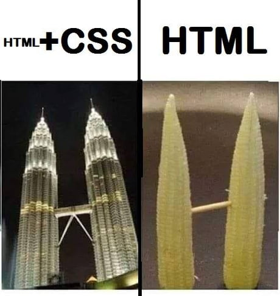
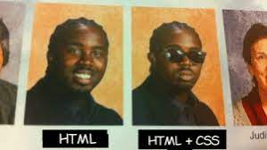
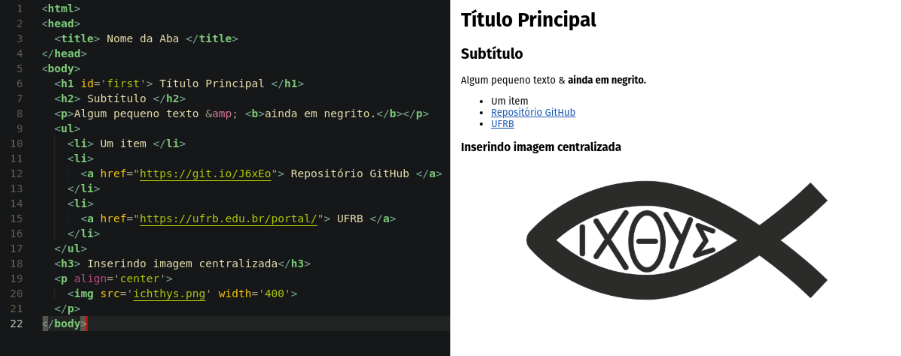
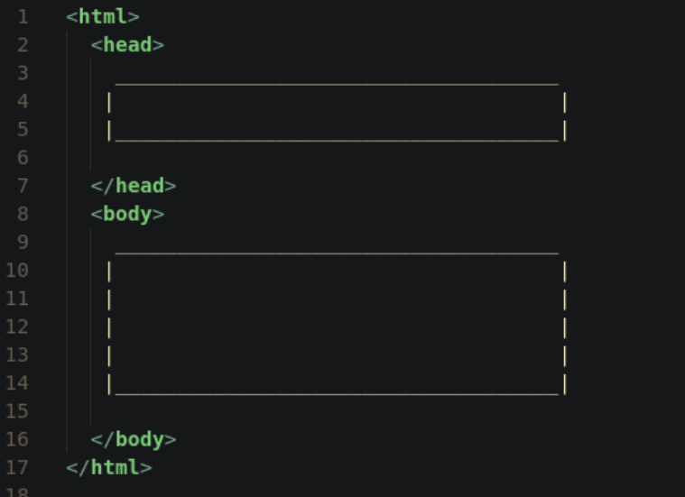

---
output:
  xaringan::moon_reader:
    css: xaringan-themer.css
    chakra: ../libs/remark-latest.min.js
    nature:
      slideNumberFormat: "%current%"
      highlightStyle: github
      highlightLines: true
      ratio: 16:9
      countIncrementalSlides: true
---
class: middle, center
background-image: url(../img/capa.png)
background-size: cover

---
class: middle, right
background-image: url(../img/espera.gif)
background-position: left
background-size: contain

## Começamos em ...

.pull-right[
```{r, echo=FALSE}
countdown::countdown(
  minutes = 5, 
  seconds = 30, 
#  left = 0, right = 0,
  play_sound = TRUE,
  padding = "50px", 
#  margin = "20%",
  font_size = "4em"
)
```
]

```{r xaringan-themer, include=FALSE, warning=FALSE}
library(xaringanthemer)
style_duo_accent(
  primary_color = "#1F487E", #"#061A40",
  secondary_color = "#E98A15",
  inverse_header_color = "#FFFFFF"
)
```

```{r xaringanExtra, echo=FALSE}
xaringanExtra::use_tile_view()   # para overview
xaringanExtra::use_scribble()    # para fazer anotações
xaringanExtra::use_panelset()    # para abas
xaringanExtra::use_clipboard()   # botão para copiar código
xaringanExtra::use_extra_styles(
  hover_code_line = TRUE,         #<<
  mute_unhighlighted_code = TRUE  #<<
)
xaringanExtra::use_progress_bar(color = "#0051BA", location = "top")
```

---
class: middle, left
background-image: url(../img/bem-vindos.gif)
background-position: right
background-size: contain

## Sejam Bem-Vindos!


---
class: inverse center middle

# Informações Iniciais

---
## Sobre esse minicurso

.panelset[
.panel[.panel-name[Serei um Hacker?]

.pull-left[
#### A Realidade

- Uma introdução ao Web Scraping!

- Uma ferramenta profissional


- Uma introdução ao R
]

.pull-right[
```{r, echo=FALSE, fig.align='center', out.width='150%'}
knitr::include_graphics("../img/hacker.gif")
```
]

]
.panel[.panel-name[Horário Geral]

#### Um Desejo

| Horário         | Atividade                             |
| :-------------- | :------------------------------------ |
| 19h até 20:45h  | `r emo::ji("book")` _Parte Teórica I_ |
| 20:45 até 21h   | `r emo::ji("breakfast")` Intervalo    |
| 21h até 22h     | `r emo::ji("book")` _Parte Teórica_ ou `r emo::ji("computer")` _Prática_ |

]

.panel[.panel-name[Programação]

.pull-left[
#### Primeiro Dia (07/03/2022)

- Informações sobre o curso;
- Avisos;
- Conhecendo o Web Scraping;
- Praticando antes de começar
    + Analisando dois scripts;
    + Raspando arquivos de R.

]

.pull-right[
#### Segundo Dia (09/03/2022)
- Introdução ao R (conceitos básicos)
- Introdução ao Tidyverse (o que usaremos)

#### Terceito Dia (11/03/2022)
- Ética no Web Scraping
- Parte Prática
- Exercícios
]
]

.panel[.panel-name[Site]

```{r, echo=FALSE, fig.align='center', out.width='30%'}
knitr::include_graphics("../img/github-nome.png")
```

<p align='center'>
  <a href="https://github.com/icaro-freire/minicurso_web-scraping">
    https://github.com/icaro-freire/minicurso_web-scraping
  </a>
</p>

]

]

---
class: inverse center middle

# O que é Web Scraping?

---
class: middle, left
background-image: url(../img/cuidado.gif)
background-position: right
background-size: contain

## Um Aviso ...

--
- Há limite temporal

--
- Há limite computacional

--
- A coisa pode, simplesmente, não dar certo!

---
class: middle, left
background-image: url(../img/what.gif)
background-position: right
background-size: contain

## Definição?

--
- Etmologia

--
  + _Web_ = Rede
  
--
  + _Scraping_ = Raspando
  
--

> O processo de **leitura**, **seleção**, **limpeza** </br> 
  e **armazenagem** desses dados de forma </br> 
  _automatizada_ é o que queremos dizer </br>
  por  “Web Scraping”.


---
class: middle, left
background-image: url(../img/workflow_scrape.png)
background-position: right
background-size: contain

## Entendendo as etapas ...

1. **Leitura**
  - há uma Matrix (`Ctrl + u`)
  - há uma linguagem (HTML)
  - ferramentas especiais de leitura
  - `rvest::read_html()`
2. **Arrumação**
  - _seleção_, `rvest` ;
  - _limpeza_, `stringr`
3. **Armazenagem**
  - `tibble::tibble`
  - `readr::write_csv()`

---
class: inverse center middle

# Entendendo o HTML

---
class: middle, left
background-image: url(../img/jacare.gif)
background-position: right
background-size: contain

## A tríade da Matrix

--

- **HTML** = Conteúdo

--

- **CSS** = Aparência

--

- **Java Script** = Interatividade

<!---------------------------------------------------------------------------->

---
# Momento Memes

.panelset[
<!---------------------------------------------------------------------------->
.panel[.panel-name[Meme 1]

```{r, echo=FALSE, fig.align='center', out.width='30%'}
knitr::include_graphics("../img/meme1.jpeg")
```


]
.panel[.panel-name[Meme 2]

```{r, echo=FALSE, fig.align='center'}
knitr::include_graphics("../img/meme2.jpg")
```


]
.panel[.panel-name[Meme 3]

```{r, echo=FALSE, fig.align='center', out.width='30%'}

```

]
.panel[.panel-name[Meme 4]

```{r, echo=FALSE, fig.align='center'}

```

]
.panel[.panel-name[Meme 5]

```{r, echo=FALSE, fig.align='center'}
knitr::include_graphics("../img/meme5.jpg")
```

]
<!---------------------------------------------------------------------------->
]

---
class: middle, left
background-image: url(../img/fall.gif)
background-position: right
background-size: 650px

# Pequeno teste ...

- Extensão para Chrome
  + [Web Developer](https://chrome.google.com/webstore/detail/web-developer/bfbameneiokkgbdmiekhjnmfkcnldhhm?hl=pt-BR)

---
class: inverse center middle

# Estrutura do HTML

---
## Entendendo a estrutura

.panelset[

.panel[.panel-name[Uma linguagem de Marcação]

```{r, echo=FALSE, out.width='50%', fig.align='center'}
knitr::include_graphics("../img/html-code.png")
```

]

.panel[.panel-name[Intrepretação do Browser]

```{r, echo=FALSE, fig.align='center'}

```
]

.panel[.panel-name[Estruturação Básica]

```{r, echo=FALSE, out.width='50%', fig.align='center'}

```
]

.panel[.panel-name[O código]

```{r, eval=FALSE}
<html>
<head>
  <title> Nome da Aba </title>
</head>
<body>
  <h1 id='first'> Título Principal </h1>
  <h2> Subtítulo </h2>
  <p>Algum pequeno texto &amp; <b>ainda em negrito.</b></p>
  <ul>
    <li> Um item </li>
    <li> <a href="https://git.io/J6xEo"> Repositório GitHub </a> </li>
    <li> <a href="https://ufrb.edu.br/portal/"> UFRB </a> </li>
  </ul>
  <h3> Inserindo imagem centralizada</h3>
  <p align='center'>  </p>
</body>
```


]

]

---
## Tags & Cia

.panelset[
.panel[.panel-name[Observações]

#### Observe que ...

- delimitamos os elementos do html por _tags_ : `<elemento> ... </elemento>`
- algumas _tags_ não precisam de "abertura e fechamento"
  + ``
  + `</br>`
- “Elementos” no html são compostos por _tags_ que especificam **um** “elemento”, 
seus “atributos” e o “conteúdo”

]

.panel[.panel-name[Composição]

#### Elemento Pai, Filho, Atributos e Conteúdo

```{r, eval=FALSE}
<a href='https://github.com/icaro-freire/minicurso_web-scraping'> 
  Repositório <b>GitHub</b> 
</a>
```

- **Elemento Pai:** `a`;
- **Elemento Filho:** `b`
- **Atributo:** `href='https://github.com/icaro-freire/minicurso_web-scraping'`
  + **nome:** `href`
  + **valor:** `https://github.com/icaro-freire/minicurso_web-scraping`
- **Conteúdo:** Repositório GitHub 
]

.panel[.panel-name[Tags Importantes]

|elemento       | descrição |
|-------------- | --------- |
|`h1`,..., `h6` | Tamanhos decrescentes dos títulos de seções |
|`p`            | delimita parágrafos |
|`ol` ou `ul`	| Cria "listas ordenadas" ( _ordered list_ ) ou "listas não ordenadas" ( _unordered list_ )|
|`li`	        | Demarca o início de um dos itens da lista |
|`img`	      | Insere uma imagem no documento |
|`a`          | Para hiperlinks em páginas, imagens, textos, etc. |
|`b`          | Para negrito |
|`i`          | Para itálico |
|`table`      | Para tabelas |

]

]

---
class: inverse center middle

# E o CSS?

---
## SelectorGadget

- Usaremos uma extensão no Chorme, para seleção dos elementos CSS
  + [SelectorGadget](https://chrome.google.com/webstore/detail/selectorgadget/mhjhnkcfbdhnjickkkdbjoemdmbfginb)

- Se seu navegador for o FireFox, salvar o código abaixo numa aba; e, marcar como 
favorito
  + [https://termbin.com/kx1gv](https://termbin.com/kx1gv)

<!----------------------------------------------------------------------------->

---
class: middle, left
background-image: url(../img/desafio.gif)
background-position: right
background-size: contain

# Exercício

Entre no site [https://bityli.com/mRWzo](https://bityli.com/mRWzo), </br> 
etive o SelectorGadget e responda:

1. Qual o elemento CSS para os </br> títulos dos livros?
2. E para o preço antigo?
3. E para o novo?

---
class: center, middle

# Obrigado!

</br>
Slides criados com </br> [`xaringan`](https://github.com/yihui/xaringan) e [`xaringanthemer`](https://github.com/gadenbuie/xaringanthemer).

</br>
</br>
</br>

