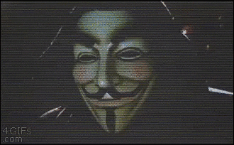

---
output:
  xaringan::moon_reader:
    css: xaringan-themer.css
    nature:
      slideNumberFormat: "%current%"
      highlightStyle: github
      highlightLines: true
      ratio: 16:9
      countIncrementalSlides: true
---
class: middle, center
background-image: url(../img/capa.png)
background-size: cover

---
class: middle, right
background-image: url(../img/espera.gif)
background-position: left
background-size: contain

## Começamos em ...

.pull-right[
```{r, echo=FALSE}
countdown::countdown(
  minutes = 5, 
  seconds = 30, 
#  left = 0, right = 0,
  play_sound = TRUE,
  padding = "50px", 
#  margin = "20%",
  font_size = "4em"
)
```
]

```{r xaringan-themer, include=FALSE, warning=FALSE}
library(xaringanthemer)
style_duo_accent(
  primary_color = "#1F487E", #"#061A40",
  secondary_color = "#E98A15",
  inverse_header_color = "#FFFFFF"
)
```

```{r xaringanExtra, echo=FALSE}
xaringanExtra::use_tile_view()   # para overview
xaringanExtra::use_scribble()    # para fazer anotações
xaringanExtra::use_panelset()    # para abas
xaringanExtra::use_clipboard()   # botão para copiar código
xaringanExtra::use_extra_styles(
  hover_code_line = TRUE,         #<<
  mute_unhighlighted_code = TRUE  #<<
)
xaringanExtra::use_progress_bar(color = "#0051BA", location = "top")
```

---
class: middle, left
background-image: url(../img/bem-vindos.gif)
background-position: right
background-size: contain

## Sejam Bem-Vindos!


---
class: inverse center middle

# Informações Iniciais

---
## Sobre esse minicurso

.panelset[
.panel[.panel-name[Serei um Hacker?]

.pull-left[
#### A Realidade

- Uma introdução ao Web Scraping!

- Uma ferramenta profissional


- Uma introdução ao R
]

.pull-right[
```{r, echo=FALSE, fig.align='center', out.width='150%'}

```
]

]
.panel[.panel-name[Horário Geral]

#### Um Desejo

| Horário         | Atividade                             |
| :-------------- | :------------------------------------ |
| 19h até 20:45h  | `r emo::ji("book")` _Parte Teórica I_ |
| 20:45 até 21h   | `r emo::ji("breakfast")` Intervalo    |
| 21h até 22h     | `r emo::ji("book")` _Parte Teórica_ ou `r emo::ji("computer")` _Prática_ |

]

.panel[.panel-name[Programação]

.pull-left[
#### Primeiro Dia (07/03/2022)

- Informações sobre o curso;
- Avisos;
- Conhecendo o Web Scraping;
- Praticando antes de começar
    + Analisando dois scripts;
    + Raspando arquivos de R.

]

.pull-right[
#### Segundo Dia (09/03/2022)
- Introdução ao R (conceitos básicos)
- Introdução ao Tidyverse (o que usaremos)

#### Terceito Dia (11/03/2022)
- Ética no Web Scraping
- Parte Prática
- Exercícios
]
]

.panel[.panel-name[Site]

```{r, echo=FALSE, fig.align='center', out.width='30%'}

```

<p align='center'>
  <a href="https://github.com/icaro-freire/minicurso_web-scraping">
    https://github.com/icaro-freire/minicurso_web-scraping
  </a>
</p>

]

]

---
class: inverse center middle

# O que é Web Scraping?

---
class: middle, left
background-image: url(../img/cuidado.gif)
background-position: right
background-size: contain

## Um Aviso ...

--
- Há limite temporal

--
- Há limite computacional

--
- A coisa pode, simplesmente, não dar certo!

---
class: middle, left
background-image: url(../img/what.gif)
background-position: right
background-size: contain

## Definição?

--
- Etmologia

--
  + _Web_ = Rede
  
--
  + _Scraping_ = Raspando
  
--

> O processo de **leitura**, **seleção**, **limpeza** </br> 
  e **armazenagem** desses dados de forma </br> 
  _automatizada_ é o que queremos dizer </br>
  por  “Web Scraping”.


---
class: middle, left
background-image: url(../img/workflow_scrape.png)
background-position: right
background-size: contain

## Entendendo as etapas ...

1. **Leitura**
  - há uma Matrix (`Ctrl + u`)
  - há uma linguagem (HTML)
  - ferramentas especiais de leitura
  - `rvest::read_html()`
2. **Arrumação**
  - _seleção_, `rvest`;
  - _limpeza_, `stringr`
3. **Armazenagem**
  - `tibble::tibble`
  - `readr::write_csv()`


---
class: center, middle

# Obrigado!

</br>
Slides criados com </br> [`xaringan`](https://github.com/yihui/xaringan) e [`xaringanthemer`](https://github.com/gadenbuie/xaringanthemer).

</br>
</br>
</br>

